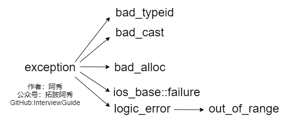
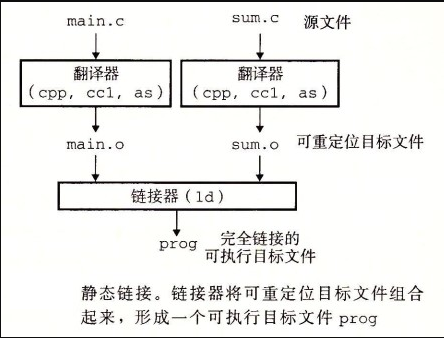
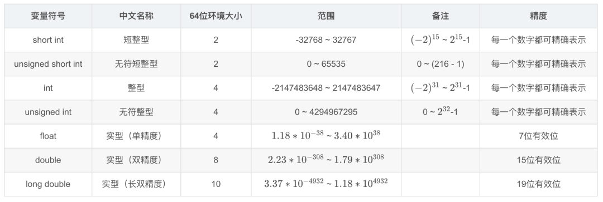

# 语法综合
## 1 C++ 11有哪些新特性？
 C++11新添加了很多新特性，如：
- nullptr替代 NULL
- 引入了 auto 和 decltype 这两个关键字实现了类型推导
- 基于范围的 for 循环for(auto& i : res){}
- 类和结构体的中初始化列表
- Lambda 表达式（匿名函数）
- std::forward_list（单向链表）
- 右值引用和move语义
- 无序容器和正则表达式
- 成员变量默认初始化
- 智能指针等
## 2 Python和C++有什么区别？
包括但不限于：
- Python是一种脚本语言，是解释执行的，而C\+\+是编译语言，是需要编译后在特定平台运行的。python可以很方便的跨平台，但是效率没有C\+\+高。
- Python使用缩进来区分不同的代码块，C\+\+使用花括号来区分
- C\+\+中需要事先定义变量的类型，而Python不需要，Python的基本数据类型只有数字，布尔值，字符串，列表，元组等等
- Python的库函数比C\+\+的多，调用起来很方便
## 3 宏定义和函数有何区别？
- 宏在预处理阶段完成替换，之后被替换的文本参与编译，相当于直接插入了代码，运行时不存在函数调用，执行起来更快；函数调用在运行时需要跳转到具体调用函数。
- 宏定义属于在结构中插入代码，没有返回值；函数调用具有返回值。
- 宏定义参数没有类型，不进行类型检查；函数参数具有类型，需要检查类型。
- 宏定义不要在最后加分号。
- 
## 4 变量声明和定义区别？
- 声明仅仅是把变量的声明的位置及类型提供给编译器，并不分配内存空间；定义要在定义的地方为其分配存储空间。
- 相同变量可以在多处声明（外部变量extern），但只能在一处定义。
## 5 一个指针占多少字节？
在16题中有提到sizeof（str）的值为8，是在64位的编译环境下的，指针的占用大小为8字节；
而在32位环境下，指针占用大小为4字节。
一个指针占内存的大小跟编译环境有关，而与机器的位数无关。
还有疑问的，可以自行打开Visual Studio编译器自己实验一番。
## 6 a和&a有什么区别？
假设数组int a[10]; int (*p)[10] = &a;其中：
- a是数组名，是数组首元素地址，+1表示地址值加上一个int类型的大小，如果a的值是0x00000001，加1操作后变为0x00000005。*(a + 1) = a[1]。
- &a是数组的指针，其类型为int (*)[10]（就是前面提到的数组指针），其加1时，系统会认为是数组首地址加上整个数组的偏移（10个int型变量），值为数组a尾元素后一个元素的地址。
- 若(int *)p ，此时输出 *p时，其值为a[0]的值，因为被转为int *类型，解引用时按照int类型大小来读取。
## 7 C++和C语言的区别
 区别
- C++中new和delete是对内存分配的运算符，取代了C中的malloc和free。
- 标准C++中的字符串类取代了标准C函数库头文件中的字符数组处理函数（C中没有字符串类型）。
- C++中用来做控制态输入输出的iostream类库替代了标准C中的stdio函数库。
- C++中的try/catch/throw异常处理机制取代了标准C中的setjmp()和longjmp()函数。
- 在C++中，允许有相同的函数名，不过它们的参数类型不能完全相同，这样这些函数就可以相互区别开来。而这在C语言中是不允许的。也就是C++可以重载，C语言不允许。
- C++语言中，允许变量定义语句在程序中的任何地方，只要在是使用它之前就可以；而C语言中，必须要在函数开头部分。而且C++不允许重复定义变量，C语言也是做不到这一点的
- 在C++中，除了值和指针之外，新增了引用。引用型变量是其他变量的一个别名，我们可以认为他们只是名字不相同，其他都是相同的。
- C++相对与C增加了一些关键字，如：bool、using、dynamic_cast、namespace等等
## 8 C++与Java的区别
  语言特性
- Java语言给开发人员提供了更为简洁的语法；完全面向对象，由于JVM可以安装到任何的操作系统上，所以说它的可移植性强
- Java语言中没有指针的概念，引入了真正的数组。不同于C++中利用指针实现的“伪数组”，Java引入了真正的数组，同时将容易造成麻烦的指针从语言中去掉，这将有利于防止在C++程序中常见的因为数组操作越界等指针操作而对系统数据进行非法读写带来的不安全问题
- C++也可以在其他系统运行，但是需要不同的编码（这一点不如Java，只编写一次代码，到处运行），例如对一个数字，在windows下是大端存储，在unix中则为小端存储。Java程序一般都是生成字节码，在JVM里面运行得到结果
- Java用接口(Interface)技术取代C++程序中的抽象类。接口与抽象类有同样的功能，但是省却了在实现和维护上的复杂性
  垃圾回收
- C++用析构函数回收垃圾，写C和C++程序时一定要注意内存的申请和释放
- Java语言不使用指针，内存的分配和回收都是自动进行的，程序员无须考虑内存碎片的问题
  应用场景
- Java在桌面程序上不如C++实用，C++可以直接编译成exe文件，指针是c++的优势，可以直接对内存的操作，但同时具有危险性 。（操作内存的确是一项非常危险的事情，一旦指针指向的位置发生错误，或者误删除了内存中某个地址单元存放的重要数据，后果是可想而知的）
- Java在Web 应用上具有C++ 无可比拟的优势，具有丰富多样的框架
- 对于底层程序的编程以及控制方面的编程，C++很灵活，因为有句柄的存在
## 9 初始化和赋值的区别
- 对于简单类型来说，初始化和赋值没什么区别
- 对于类和复杂数据类型来说，这两者的区别就大了，举例如下：
```cpp
class A{
public:
    int num1;
    int num2;
public:
    A(int a=0, int b=0):num1(a),num2(b){};
    A(const A& a){};
    //重载 = 号操作符函数
    A& operator=(const A& a){
        num1 = a.num1 + 1;
        num2 = a.num2 + 1;
        return *this;
    };
};
int main(){
    A a(1,1);
    A a1 = a; //拷贝初始化操作，调用拷贝构造函数
    A b;
    b = a;//赋值操作，对象a中，num1 = 1，num2 = 1；对象b中，num1 = 2，num2 = 2
    return 0;
}
```
## 10 C和C++的类型安全
  **什么是类型安全？**
类型安全很大程度上可以等价于内存安全，类型安全的代码不会试图访问自己没被授权的内存区域。“类型安全”常被用来形容编程语言，其根据在于该门编程语言是否提供保障类型安全的机制；有的时候也用“类型安全”形容某个程序，判别的标准在于该程序是否隐含类型错误。
类型安全的编程语言与类型安全的程序之间，没有必然联系。好的程序员可以使用类型不那么安全的语言写出类型相当安全的程序，相反的，差一点儿的程序员可能使用类型相当安全的语言写出类型不太安全的程序。绝对类型安全的编程语言暂时还没有。
  （1）C的类型安全**
C只在局部上下文中表现出类型安全，比如试图从一种结构体的指针转换成另一种结构体的指针时，编译器将会报告错误，除非使用显式类型转换。然而，C中相当多的操作是不安全的。以下是两个十分常见的例子：
- printf格式输出

上述代码中，使用%d控制整型数字的输出，没有问题，但是改成%f时，明显输出错误，再改成%s时，运行直接报segmentation fault错误
- malloc函数的返回值
malloc是C中进行内存分配的函数，它的返回类型是void\*即空类型指针，常常有这样的用法char\* pStr=(char\*)malloc(100\*sizeof(char))，这里明显做了显式的类型转换。
类型匹配尚且没有问题，但是一旦出现int\* pInt=(int*)malloc(100\*sizeof(char))就很可能带来一些问题，而这样的转换C并不会提示错误。
  （2）C++的类型安全
如果C++使用得当，它将远比C更有类型安全性。相比于C语言，C++提供了一些新的机制保障类型安全：
- 操作符new返回的指针类型严格与对象匹配，而不是void\*
- C中很多以void\*为参数的函数可以改写为C++模板函数，而模板是支持类型检查的；
- 引入const关键字代替define constants，它是有类型、有作用域的，而define constants只是简单的文本替换
- 一些define宏可被改写为inline函数，结合函数的重载，可在类型安全的前提下支持多种类型，当然改写为模板也能保证类型安全
- C++提供了**dynamic_cast**关键字，使得转换过程更加安全，因为dynamic_cast比static_cast涉及更多具体的类型检查。
  例1：使用void\*进行类型转换
  
    例2：不同类型指针之间转换
```cpp
include<iostream>
using namespace std;
 
class Parent{};
class Child1 : public Parent
{
public:
    int i;
    Child1(int e):i(e){}
};
class Child2 : public Parent
{
public:
    double d;
    Child2(double e):d(e){}
};
int main()
{
    Child1 c1(5);
    Child2 c2(4.1);
    Parent* pp;
    Child1* pc1;
    
    pp=&c1; 
    pc1=(Child1*)pp;  // 类型向下转换 强制转换，由于类型仍然为Child1*，不造成错误
    cout<<pc1->i<<endl; //输出：5
 
    pp=&c2;
    pc1=(Child1*)pp;  //强制转换，且类型发生变化，将造成错误
    cout<<pc1->i<<endl;// 输出：1717986918
    return 0;
}
```
上面两个例子之所以引起类型不安全的问题，是因为程序员使用不得当。第一个例子用到了空类型指针void\*，第二个例子则是在两个类型指针之间进行强制转换。
因此，想保证程序的类型安全性，应尽量避免使用空类型指针void\*，尽量不对两种类型指针做强制转换。
## 11 浅拷贝和深拷贝的区别
  **浅拷贝**
浅拷贝只是拷贝一个指针，并没有新开辟一个地址，拷贝的指针和原来的指针指向同一块地址，如果原来的指针所指向的资源释放了，那么再释放浅拷贝的指针的资源就会出现错误。
  **深拷贝**
深拷贝不仅拷贝值，还开辟出一块新的空间用来存放新的值，即使原先的对象被析构掉，释放内存了也不会影响到深拷贝得到的值。
在自己实现拷贝赋值的时候，如果有指针变量的话是需要自己实现深拷贝的。
```cpp
include <iostream>  
include <string.h>
using namespace std;
 
class Student
{
private:
    int num;
    char *name;
public:
    Student(){
        name = new char(20);
        cout << "Student" << endl;
    };
    ~Student(){
        cout << "~Student " << &name << endl;
        delete name;
        name = NULL;
    };
    Student(const Student &s){//拷贝构造函数
        //浅拷贝，当对象的name和传入对象的name指向相同的地址
        name = s.name;
        //深拷贝
        //name = new char(20);
        //memcpy(name, s.name, strlen(s.name));
        cout << "copy Student" << endl;
    };
};
 
int main()
{
    {// 花括号让s1和s2变成局部对象，方便测试
        Student s1;
        Student s2(s1);// 复制对象
    }
    system("pause");
    return 0;
}
//浅拷贝执行结果：
//Student
//copy Student
//~Student 0x7fffed0c3ec0
//~Student 0x7fffed0c3ed0
//*** Error in `/tmp/815453382/a.out': double free or corruption (fasttop): 0x0000000001c82c20 ***
//深拷贝执行结果：
//Student
//copy Student
//~Student 0x7fffebca9fb0
//~Student 0x7fffebca9fc0
```
从执行结果可以看出，浅拷贝在对象的拷贝创建时存在风险，即被拷贝的对象析构释放资源之后，拷贝对象析构时会再次释放一个已经释放的资源，深拷贝的结果是两个对象之间没有任何关系，各自成员地址不同。
## 12 C++的异常处理的方法
在程序执行过程中，由于程序员的疏忽或是系统资源紧张等因素都有可能导致异常，任何程序都无法保证绝对的稳定，常见的异常有：
- 数组下标越界
- 除法计算时除数为0
- 动态分配空间时空间不足
- ...
如果不及时对这些异常进行处理，程序多数情况下都会崩溃。
  **（1）try、throw和catch关键字**
C++中的异常处理机制主要使用**try**、**throw**和**catch**三个关键字，其在程序中的用法如下：
```cpp
include <iostream>
using namespace std;
int main()
{
    double m = 1, n = 0;
    try {
        cout << "before dividing." << endl;
        if (n == 0)
            throw - 1;  //抛出int型异常
        else if (m == 0)
            throw - 1.0;  //拋出 double 型异常
        else
            cout << m / n << endl;
        cout << "after dividing." << endl;
    }
    catch (double d) {
        cout << "catch (double)" << d << endl;
    }
    catch (...) {
        cout << "catch (...)" << endl;
    }
    cout << "finished" << endl;
    return 0;
}
//运行结果
//before dividing.
//catch (...)
//finished
```
代码中，对两个数进行除法计算，其中除数为0。可以看到以上三个关键字，程序的执行流程是先执行try包裹的语句块，如果执行过程中没有异常发生，则不会进入任何catch包裹的语句块，如果发生异常，则使用throw进行异常抛出，再由catch进行捕获，throw可以抛出各种数据类型的信息，代码中使用的是数字，也可以自定义异常class。**catch根据throw抛出的数据类型进行精确捕获（不会出现类型转换），如果匹配不到就直接报错，可以使用catch(...)的方式捕获任何异常（不推荐）。**当然，如果catch了异常，当前函数如果不进行处理，或者已经处理了想通知上一层的调用者，可以在catch里面再throw异常。
  **（2）函数的异常声明列表**
有时候，程序员在定义函数的时候知道函数可能发生的异常，可以在函数声明和定义时，指出所能抛出异常的列表，写法如下：
```C++
int fun() throw(int,double,A,B,C){...};
```
这种写法表名函数可能会抛出int,double型或者A、B、C三种类型的异常，如果throw中为空，表明不会抛出任何异常，如果没有throw则可能抛出任何异常
  **（3）C++标准异常类  exception**
C++ 标准库中有一些类代表异常，这些类都是从 exception 类派生而来的，如下图所示

- bad_typeid：使用typeid运算符，如果其操作数是一个多态类的指针，而该指针的值为 NULL，则会拋出此异常，例如：
```cpp
include <iostream>
include <typeinfo>
using namespace std;
class A{
public:
  virtual ~A();
};
 
using namespace std;
int main() {
    A* a = NULL;
    try {
        cout << typeid(*a).name() << endl; // Error condition
    }
    catch (bad_typeid){
        cout << "Object is NULL" << endl;
    }
    return 0;
}
//运行结果：bject is NULL
```
- bad_cast：在用 dynamic_cast 进行从多态基类对象（或引用）到派生类的引用的强制类型转换时，如果转换是不安全的，则会拋出此异常
- bad_alloc：在用 new 运算符进行动态内存分配时，如果没有足够的内存，则会引发此异常
- out_of_range:用 vector 或 string的at 成员函数根据下标访问元素时，如果下标越界，则会拋出此异常
8)  
## 13 C++中新增了string，它与C语言中的 char *有什么区别吗？它是如何实现的？
string继承自basic_string,其实是对char\*进行了封装，封装的string包含了char\*数组，容量，长度等等属性。
string可以进行动态扩展，在每次扩展的时候另外申请一块原空间大小两倍的空间（2*n），然后将原字符串拷贝过去，并加上新增的内容。
## 14 介绍C++面向对象的三大特性，并且举例说明
三大特性：继承、封装和多态
  **（1）继承**
**让某种类型对象获得另一个类型对象的属性和方法。**
它可以使用现有类的所有功能，并在无需重新编写原来的类的情况下对这些功能进行扩展
常见的继承有三种方式：
1. 实现继承：指使用基类的属性和方法而无需额外编码的能力
2. 接口继承：指仅使用属性和方法的名称、但是子类必须提供实现的能力
3. 可视继承：指子窗体（类）使用基窗体（类）的外观和实现代码的能力（C++里好像不怎么用）
例如，将人定义为一个抽象类，拥有姓名、性别、年龄等公共属性，吃饭、睡觉、走路等公共方法，在定义一个具体的人时，就可以继承这个抽象类，既保留了公共属性和方法，也可以在此基础上扩展跳舞、唱歌等特有方法
    **（2）封装**
数据和代码捆绑在一起，避免外界干扰和不确定性访问。
封装，也就是**把客观事物封装成抽象的类**，并且类可以把自己的数据和方法只让可信的类或者对象操作，对不可信的进行信息隐藏，例如：将公共的数据或方法使用public修饰，而不希望被访问的数据或方法采用private修饰。
    **（3）多态**  
同一事物表现出不同事物的能力，即向不同对象发送同一消息，不同的对象在接收时会产生不同的行为**（重载实现编译时多态，虚函数实现运行时多态）**。
多态性是允许你将父对象设置成为和一个或更多的他的子对象相等的技术，赋值之后，父对象就可以根据当前赋值给它的子对象的特性以不同的方式运作。**简单一句话：允许将子类类型的指针赋值给父类类型的指针**
实现多态有二种方式：覆盖（override），重载（overload）。
覆盖：是指子类重新定义父类的虚函数的做法。
重载：是指允许存在多个同名函数，而这些函数的参数表不同（或许参数个数不同，或许参数类型不同，或许两者都不同）。例如：基类是一个抽象对象——人，那教师、运动员也是人，而使用这个抽象对象既可以表示教师、也可以表示运动员。
## 15 写C++代码时有一类错误是 coredump ，很常见，你遇到过吗？怎么调试这个错误？
coredump是程序由于异常或者bug在运行时异常退出或者终止，在一定的条件下生成的一个叫做core的文件，这个core文件会记录程序在运行时的内存，寄存器状态，内存指针和函数堆栈信息等等。
对这个文件进行分析可以定位到程序异常的时候对应的堆栈调用信息。
* 使用gdb命令对core文件进行调试
以下例子在Linux上编写一段代码并导致segment fault 并产生core文件
```cpp
mkdir coredumpTest
vim coredumpTest.cpp
```
在编辑器内键入
```cpp
include<stdio.h>
int main(){
    int i;
    scanf("%d",i);//正确的应该是&i,这里使用i会导致segment fault
    printf("%d\n",i);
    return 0;
}
```
编译
```cpp
g++ coredumpTest.cpp -g -o coredumpTest
```
运行
```cpp
./coredumpTest
```
使用gdb调试coredump
```cpp
gdb [可执行文件名] [core文件名]
```
## 16 静态类型和动态类型，静态绑定和动态绑定的介绍
- 静态类型：对象在声明时采用的类型，在编译期既已确定；
- 动态类型：通常是指一个指针或引用目前所指对象的类型，是在运行期决定的；
- 静态绑定：绑定的是静态类型，所对应的函数或属性依赖于对象的静态类型，发生在编译期；
- 动态绑定：绑定的是动态类型，所对应的函数或属性依赖于对象的动态类型，发生在运行期；
  从上面的定义也可以看出，非虚函数一般都是静态绑定，而虚函数都是动态绑定（如此才可实现多态性）。
  举个例子：
```cpp
include <iostream>
using namespace std;
class A
{
public:
    /*virtual*/ void func() { std::cout << "A::func()\n"; }
};
class B : public A
{
public:
    void func() { std::cout << "B::func()\n"; }
};
class C : public A
{
public:
    void func() { std::cout << "C::func()\n"; }
};
int main()
{
    C* pc = new C(); //pc的静态类型是它声明的类型C*，动态类型也是C*；
    B* pb = new B(); //pb的静态类型和动态类型也都是B*；
    A* pa = pc;      //pa的静态类型是它声明的类型A*，动态类型是pa所指向的对象pc的类型C*；
    pa = pb;         //pa的动态类型可以更改，现在它的动态类型是B*，但其静态类型仍是声明时候的A*；
    C *pnull = NULL; //pnull的静态类型是它声明的类型C*,没有动态类型，因为它指向了NULL；
    
    pa->func();      //A::func() pa的静态类型永远都是A*，不管其指向的是哪个子类，都是直接调用A::func()；
    pc->func();      //C::func() pc的动、静态类型都是C*，因此调用C::func()；
    pnull->func();   //C::func() 不用奇怪为什么空指针也可以调用函数，因为这在编译期就确定了，和指针空不空没关系；
    return 0;
}
```
如果将A类中的virtual注释去掉，则运行结果是：
```cpp
pa->func();      //B::func() 因为有了virtual虚函数特性，pa的动态类型指向B*，因此先在B中查找，找到后直接调用；
pc->func();      //C::func() pc的动、静态类型都是C*，因此也是先在C中查找；
pnull->func();   //空指针异常，因为是func是virtual函数，因此对func的调用只能等到运行期才能确定，然后才发现pnull是空指针；
```
在上面的例子中，
- 如果基类A中的func不是virtual函数，那么不论pa、pb、pc指向哪个子类对象，对func的调用都是在定义pa、pb、pc时的静态类型决定，早已在编译期确定了。
- 同样的空指针也能够直接调用no-virtual函数而不报错（这也说明一定要做空指针检查啊！），因此静态绑定不能实现多态；
- 如果func是虚函数，那所有的调用都要等到运行时根据其指向对象的类型才能确定，比起静态绑定自然是要有性能损失的，但是却能实现多态特性；
 **本文代码里都是针对指针的情况来分析的，但是对于引用的情况同样适用。**
 至此总结一下静态绑定和动态绑定的区别：
- 静态绑定发生在编译期，动态绑定发生在运行期；
- 对象的动态类型可以更改，但是静态类型无法更改；
- 要想实现动态，必须使用动态绑定；
- 在继承体系中只有虚函数使用的是动态绑定，其他的全部是静态绑定；
  **建议：**
  绝对不要重新定义继承而来的非虚(non-virtual)函数（《Effective C++ 第三版》条款36），因为这样导致函数调用由对象声明时的静态类型确定了，而和对象本身脱离了关系，没有多态，也这将给程序留下不可预知的隐患和莫名其妙的BUG；另外，在动态绑定也即在virtual函数中，要注意默认参数的使用。当缺省参数和virtual函数一起使用的时候一定要谨慎，不然出了问题怕是很难排查。
  看下面的代码：
```cpp
include <iostream>
using namespace std;
class E
{
public:
    virtual void func(int i = 0)
    {
        std::cout << "E::func()\t" << i << "\n";
    }
};
class F : public E
{
public:
    virtual void func(int i = 1)
    {
        std::cout << "F::func()\t" << i << "\n";
    }
};
void test2()
{
    F* pf = new F();
    E* pe = pf;
    pf->func(); //F::func() 1  正常，就该如此；
    pe->func(); //F::func() 0  哇哦，这是什么情况，调用了子类的函数，却使用了基类中参数的默认值！
}
int main()
{
    test2();
    return 0;
}
```
 77、全局变量和局部变量有什么区别？
生命周期不同：全局变量随主程序创建和创建，随主程序销毁而销毁；局部变量在局部函数内部，甚至局部循环体等内部存在，退出就不存在；
使用方式不同：通过声明后全局变量在程序的各个部分都可以用到；局部变量分配在堆栈区，只能在局部使用。 
操作系统和编译器通过内存分配的位置可以区分两者，全局变量分配在全局数据段并且在程序开始运行的时候被加载。局部变量则分配在堆栈里面 。
## 17 指针加减计算要注意什么？
指针加减本质是对其所指地址的移动，移动的步长跟指针的类型是有关系的，因此在涉及到指针加减运算需要十分小心，加多或者减多都会导致指针指向一块未知的内存地址，如果再进行操作就会很危险。
  举个例子
```cpp
include <iostream>
using namespace std;
int main()
{
    int *a, *b, c;
    a = (int*)0x500;
    b = (int*)0x520;
    c = b - a;
    printf("%d\n", c); // 8
    a += 0x020;
    c = b - a;
    printf("%d\n", c); // -24
    return 0;
}
```
首先变量a和b都是以16进制的形式初始化，将它们转成10进制分别是1280（5\*16\^2=1280）和1312（5\*16\^2+2*16=1312)， 那么它们的差值为32，也就是说a和b所指向的地址之间间隔32个位，但是考虑到是int类型占4位，所以c的值为32/4=8
a自增16进制0x20之后，其实际地址变为1280 + 2\*16\*4 = 1408，（因为一个int占4位，所以要乘4），这样它们的差值就变成了1312 - 1280 = -96，所以c的值就变成了-96/4 = -24
遇到指针的计算，**需要明确的是指针每移动一位，它实际跨越的内存间隔是指针类型的长度，建议都转成10进制计算，计算结果除以类型长度取得结果**
## 18 怎样判断两个浮点数是否相等？
对两个浮点数判断大小和是否相等不能直接用==来判断，会出错！明明相等的两个数比较反而是不相等！对于两个浮点数比较只能通过相减并与预先设定的精度比较，记得要取绝对值！
浮点数与0的比较也应该注意。与浮点数的表示方式有关。
## 19 结构体变量比较是否相等
1)   重载了 “==” 操作符
~~~cpp
struct foo {
  int a;
  int b;
  bool operator==(const foo& rhs) *//* *操作运算符重载*
  {
    return( a == rhs.a) && (b == rhs.b);
  }
};
~~~
2)   元素的话，一个个比；
3)   指针直接比较，如果保存的是同一个实例地址，则(p1==p2)为真；
## 20 定义和声明的区别
   **如果是指变量的声明和定义：**
 从编译原理上来说，声明是仅仅告诉编译器，有个某类型的变量会被使用，但是编译器并不会为它分配任何内存。而定义就是分配了内存。
  **如果是指函数的声明和定义：**
 声明：一般在头文件里，对编译器说：这里我有一个函数叫function() 让编译器知道这个函数的存在。
 定义：一般在源文件里，具体就是函数的实现过程 写明函数体。
## 21 隐式转换，如何消除隐式转换？
1、C++的基本类型中并非完全的对立，部分数据类型之间是可以进行隐式转换的。
所谓隐式转换，是指不需要用户干预，编译器私下进行的类型转换行为。很多时候用户可能都不知道进行了哪些转换
2、C++面向对象的多态特性，就是通过父类的类型实现对子类的封装。通过隐式转换，你可以直接将一个子类的对象使用父类的类型进行返回。在比如，数值和布尔类型的转换，整数和浮点数的转换等。某些方面来说，隐式转换给C++程序开发者带来了不小的便捷。C++是一门强类型语言，类型的检查是非常严格的。
3、 基本数据类型 基本数据类型的转换以取值范围的作为转换基础（保证精度不丢失）。隐式转换发生在从小->大的转换中。比如从char转换为int。从int->long。自定义对象 子类对象可以隐式的转换为父类对象。
4、 C++中提供了explicit关键字，在构造函数声明的时候加上explicit关键字，能够禁止隐式转换。
5、如果构造函数只接受一个参数，则它实际上定义了转换为此类类型的隐式转换机制。可以通过将构造函数声明为explicit加以制止隐式类型转换，关键字explicit只对一个实参的构造函数有效，需要多个实参的构造函数不能用于执行隐式转换，所以无需将这些构造函数指定为explicit。
## 22 C++如何处理多个异常的？
​    C++中的异常情况：
语法错误（编译错误）：比如变量未定义、括号不匹配、关键字拼写错误等等编译器在编译时能发现的错误，这类错误可以及时被编译器发现，而且可以及时知道出错的位置及原因，方便改正。 
运行时错误：比如数组下标越界、系统内存不足等等。这类错误不易被程序员发现，它能通过编译且能进入运行，但运行时会出错，导致程序崩溃。为了有效处理程序运行时错误，C++中引入异常处理机制来解决此问题。
  C++异常处理机制
异常处理基本思想：执行一个函数的过程中发现异常，可以不用在本函数内立即进行处理， 而是抛出该异常，让函数的调用者直接或间接处理这个问题。 
 C++异常处理机制由3个模块组成：try(检查)、throw(抛出)、catch(捕获) 
抛出异常的语句格式为：throw 表达式；如果try块中程序段发现了异常则抛出异常。 
 ~~~cpp
try  {  可能抛出异常的语句；（检查） try 
 { 
 可能抛出异常的语句；（检查） 
 } 
 catch（类型名[形参名]）//捕获特定类型的异常 
 { 
 //处理1； 
 } 
 catch（类型名[形参名]）//捕获特定类型的异常 
 { 
 //处理2； 
 } 
 catch（…）//捕获所有类型的异常 
 { 
 }
 ~~~
## 23 如何在不使用额外空间的情况下，交换两个数？你有几种方法？
    1)  算术
~~~cpp
x = x + y;
 y = x - y;
x = x - y; 
~~~
    2)  异或
~~~cpp
x = x^y;// 只能对int,char..
 y = x^y;
 x = x^y;
 x ^= y ^= x;
~~~
## 24 程序在执行int main(int argc, char *argv[])时的内存结构，你了解吗？
参数的含义是程序在命令行下运行的时候，需要输入argc 个参数，每个参数是以char 类型输入的，依次存在数组里面，数组是 argv[]，所有的参数在指针
char * 指向的内存中，数组的中元素的个数为 argc 个，第一个参数为程序的名称。
## 25 C++中标准库是什么？
1)  C++ 标准库可以分为两部分：
- 标准函数库： 这个库是由通用的、独立的、不属于任何类的函数组成的。函数库继承自 C 语言。
- 面向对象类库： 这个库是类及其相关函数的集合。
2)   输入/输出 I/O、字符串和字符处理、数学、时间、日期和本地化、动态分配、其他、宽字符函数
3)   标准的 C++ I/O 类、String 类、数值类、STL 容器类、STL 算法、STL 函数对象、STL 迭代器、STL 分配器、本地化库、异常处理类、杂项支持库
## 26 你知道静态绑定和动态绑定吗？讲讲？
1)  对象的静态类型：对象在声明时采用的类型。是在编译期确定的。
2)  对象的动态类型：目前所指对象的类型。是在运行期决定的。对象的动态类型可以更改，但是静态类型无法更改。
3)  静态绑定：绑定的是对象的静态类型，某特性（比如函数依赖于对象的静态类型，发生在编译期。)
4)  动态绑定：绑定的是对象的动态类型，某特性（比如函数依赖于对象的动态类型，发生在运行期。)
## 27 怎么快速定位错误出现的地方?
1、如果是简单的错误，可以直接双击错误列表里的错误项或者生成输出的错误信息中带行号的地方就可以让编辑窗口定位到错误的位置上。
2、对于复杂的模板错误，最好使用生成输出窗口。
多数情况下出发错误的位置是最靠后的引用位置。如果这样确定不了错误，就需要先把自己写的代码里的引用位置找出来，然后逐个分析了。
## 28 你知道Debug和Release的区别是什么吗？
1)  调试版本，包含调试信息，所以容量比Release大很多，并且不进行任何优化（优化会使调试复杂化，因为源代码和生成的指令间关系会更复杂），便于程序员调试。Debug模式下生成两个文件，除了.exe或.dll文件外，还有一个.pdb文件，该文件记录了代码中断点等调试信息； 
2)  发布版本，不对源代码进行调试，编译时对应用程序的速度进行优化，使得程序在代码大小和运行速度上都是最优的。（调试信息可在单独的PDB文件中生成）。Release模式下生成一个文件.exe或.dll文件。
3)  实际上，Debug 和 Release 并没有本质的界限，他们只是一组编译选项的集合，编译器只是按照预定的选项行动。事实上，我们甚至可以修改这些选项，从而得到优化过的调试版本或是带跟踪语句的发布版本。
## 29 main函数的返回值有什么值得考究之处吗？
程序运行过程入口点main函数，main（）函数返回值类型必须是int，这样返回值才能传递给程序激活者（如操作系统）表示程序正常退出。
main（int args, char **argv） 参数的传递。参数的处理，一般会调用getopt（）函数处理，但实践中，这仅仅是一部分，不会经常用到的技能点。
## 30 什么是一致性哈希？
 **一致性哈希**
一致性哈希是一种哈希算法，就是**在移除或者增加一个结点时，能够尽可能小的改变已存在key的映射关系**
尽可能少的改变已有的映射关系，一般是沿着顺时针进行操作，回答之前可以先想想，真实情况如何处理
一致性哈希将整个哈希值空间组**织成一个虚拟的圆环**，假设哈希函数的值空间为0~2^32-1，整个哈希空间环如下左图所示

一致性hash的基本思想就是使用相同的hash算法将数据和结点都映射到图中的环形哈希空间中，上右图显示了4个数据object1-object4在环上的分布图
  **结点和数据映射**
假如有一批服务器，可以根据IP或者主机名作为关键字进行哈希，根据结果映射到哈希环中，3台服务器分别是nodeA-nodeC
现在有一批的数据object1-object4需要存在服务器上，则可以使用相同的哈希算法对数据进行哈希，其结果必然也在环上，可以沿着顺时针方向寻找，找到一个结点（服务器）则将数据存在这个结点上，这样数据和结点就产生了一对一的关联，如下图所示：

  **移除结点**
如果一台服务器出现问题，如上图中的nodeB，则受影响的是其逆时针方向至下一个结点之间的数据，只需将这些数据映射到它顺时针方向的第一个结点上即可，下左图

  **添加结点**
如果新增一台服务器nodeD，受影响的是其逆时针方向至下一个结点之间的数据，将这些数据映射到nodeD上即可，见上右图
  **虚拟结点**
假设仅有2台服务器：nodeA和nodeC，nodeA映射了1条数据，nodeC映射了3条，这样数据分布是不平衡的。引入虚拟结点，假设结点复制个数为2，则nodeA变成：nodeA1和nodeA2，nodeC变成：nodeC1和nodeC2，映射情况变成如下：

这样数据分布就均衡多了，平衡性有了很大的提高
## 31 动态编译与静态编译
1)  静态编译，编译器在编译可执行文件时，把需要用到的对应动态链接库中的部分提取出来，连接到可执行文件中去，使可执行文件在运行时不需要依赖于动态链接库；
2)  动态编译的可执行文件需要附带一个动态链接库，在执行时，需要调用其对应动态链接库的命令。所以其优点一方面是缩小了执行文件本身的体积，另一方面是加快了编译速度，节省了系统资源。缺点是哪怕是很简单的程序，只用到了链接库的一两条命令，也需要附带一个相对庞大的链接库；二是如果其他计算机上没有安装对应的运行库，则用动态编译的可执行文件就不能运行。
## 32 hello.c 程序的编译过程
以下是一个 hello.c 程序：
```cpp
include <stdio.h>
int main()
{
    printf("hello, world\n");
    return 0;
}
```
在 Unix 系统上，由编译器把源文件转换为目标文件。
```bash
gcc -o hello hello.c
```
 这个过程大致如下：

- 预处理阶段：处理以  开头的预处理命令；
- 编译阶段：翻译成汇编文件；
- 汇编阶段：将汇编文件翻译成可重定位目标文件；
- 链接阶段：将可重定位目标文件和 printf.o 等单独预编译好的目标文件进行合并，得到最终的可执行目标文件。
 静态链接
 静态链接器以一组可重定位目标文件为输入，生成一个完全链接的可执行目标文件作为输出。链接器主要完成以下两个任务：
- 符号解析：每个符号对应于一个函数、一个全局变量或一个静态变量，符号解析的目的是将每个符号引用与一个符号定义关联起来。
- 重定位：链接器通过把每个符号定义与一个内存位置关联起来，然后修改所有对这些符号的引用，使得它们指向这个内存位置。

 目标文件
- 可执行目标文件：可以直接在内存中执行；
- 可重定位目标文件：可与其它可重定位目标文件在链接阶段合并，创建一个可执行目标文件；
- 共享目标文件：这是一种特殊的可重定位目标文件，可以在运行时被动态加载进内存并链接；
 动态链接
 静态库有以下两个问题：
- 当静态库更新时那么整个程序都要重新进行链接；
- 对于 printf 这种标准函数库，如果每个程序都要有代码，这会极大浪费资源。
共享库是为了解决静态库的这两个问题而设计的，在 Linux 系统中通常用 .so 后缀来表示，Windows 系统上它们被称为 DLL。它具有以下特点：
- 在给定的文件系统中一个库只有一个文件，所有引用该库的可执行目标文件都共享这个文件，它不会被复制到引用它的可执行文件中；
- 在内存中，一个共享库的 .text 节（已编译程序的机器代码）的一个副本可以被不同的正在运行的进程共享。

**源代码－－>预处理－－>编译－－>优化－－>汇编－－>链接-->可执行文件**
1)   预处理
读取c源程序，对其中的伪指令（以开头的指令）和特殊符号进行处理。包括宏定义替换、条件编译指令、头文件包含指令、特殊符号。 预编译程序所完成的基本上是对源程序的“替代”工作。经过此种替代，生成一个没有宏定义、没有条件编译指令、没有特殊符号的输出文件。.i预处理后的c文件，.ii预处理后的C++文件。
2)   编译阶段
编译程序所要作得工作就是通过词法分析和语法分析，在确认所有的指令都符合语法规则之后，将其翻译成等价的中间代码表示或汇编代码。.s文件
3)   汇编过程
汇编过程实际上指把汇编语言代码翻译成目标机器指令的过程。对于被翻译系统处理的每一个C语言源程序，都将最终经过这一处理而得到相应的目标文件。目标文件中所存放的也就是与源程序等效的目标的机器语言代码。.o目标文件
4)   链接阶段
链接程序的主要工作就是将有关的目标文件彼此相连接，也即将在一个文件中引用的符号同该符号在另外一个文件中的定义连接起来，使得所有的这些目标文件成为一个能够诶操作系统装入执行的统一整体。
## 33 一个C/C++程序从开始编译到生成可执行文件的完整过程会经历那些过程？
四个过程：
  **（1）预编译**
主要处理源代码文件中的以“”开头的预编译指令。处理规则见下
1、删除所有的define，展开所有的宏定义。
2、处理所有的条件预编译指令，如“if”、“endif”、“ifdef”、“elif”和“else”。
3、处理“include”预编译指令，将文件内容替换到它的位置，这个过程是递归进行的，文件中包含其他
文件。
4、删除所有的注释，“//”和“/**/”。
5、保留所有的pragma 编译器指令，编译器需要用到他们，如：pragma once 是为了防止有文件被重
复引用。
6、添加行号和文件标识，便于编译时编译器产生调试用的行号信息，和编译时产生编译错误或警告是
能够显示行号。
  **（2）编译**
把预编译之后生成的xxx.i或xxx.ii文件，进行一系列词法分析、语法分析、语义分析及优化后，生成相应的汇编代码文件。
1、词法分析：利用类似于“有限状态机”的算法，将源代码程序输入到扫描机中，将其中的字符序列分割成一系列的记号。
2、语法分析：语法分析器对由扫描器产生的记号，进行语法分析，产生语法树。由语法分析器输出的语法树是一种以表达式为节点的树。
3、语义分析：语法分析器只是完成了对表达式语法层面的分析，语义分析器则对表达式是否有意义进行判断，其分析的语义是静态语义——在编译期能分期的语义，相对应的动态语义是在运行期才能确定的语义。
4、优化：源代码级别的一个优化过程。
5、目标代码生成：由代码生成器将中间代码转换成目标机器代码，生成一系列的代码序列——汇编语言表示。
6、目标代码优化：目标代码优化器对上述的目标机器代码进行优化：寻找合适的寻址方式、使用位移来替代乘法运算、删除多余的指令等。
  **（3）汇编**
将汇编代码转变成机器可以执行的指令(机器码文件)。 汇编器的汇编过程相对于编译器来说更简单，没有复杂的语法，也没有语义，更不需要做指令优化，只是根据汇编指令和机器指令的对照表一一翻译过来，汇编过程有汇编器as完成。
经汇编之后，产生目标文件(与可执行文件格式几乎一样)xxx.o(Linux下)、xxx.obj(Windows下)。
  **（4）链接**
将不同的源文件产生的目标文件进行链接，从而形成一个可以执行的程序。链接分为静态链接和动态链接：
**1、静态链接：**
函数和数据被编译进一个二进制文件。在使用静态库的情况下，在编译链接可执行文件时，链接器从库中复制这些函数和数据并把它们和应用程序的其它模块组合起来创建最终的可执行文件。
空间浪费：因为每个可执行程序中对所有需要的目标文件都要有一份副本，所以如果多个程序对同一个目标文件都有依赖，会出现同一个目标文件都在内存存在多个副本；
更新困难：每当库函数的代码修改了，这个时候就需要重新进行编译链接形成可执行程序。
运行速度快：但是静态链接的优点就是，在可执行程序中已经具备了所有执行程序所需要的任何东西，在执行的时候运行速度快。
**2、动态链接：**
动态链接的基本思想是把程序按照模块拆分成各个相对独立部分，在程序运行时才将它们链接在一起形成一个完整的程序，而不是像静态链接一样把所有程序模块都链接成一个单独的可执行文件。
共享库：就是即使需要每个程序都依赖同一个库，但是该库不会像静态链接那样在内存中存在多份副本，而是这多个程序在执行时共享同一份副本；
更新方便：更新时只需要替换原来的目标文件，而无需将所有的程序再重新链接一遍。当程序下一次运行时，新版本的目标文件会被自动加载到内存并且链接起来，程序就完成了升级的目标。
性能损耗：因为把链接推迟到了程序运行时，所以每次执行程序都需要进行链接，所以性能会有一定损失。
## 34 简单说一下traits技法
traits技法利用“内嵌型别“的编程技巧与**编译器的template参数推导功能**，增强C++未能提供的关于型别认证方面的能力。常用的有iterator_traits和type_traits。
**iterator_traits**
被称为**特性萃取机**，能够方便的让外界获取以下5种型别：
- value_type：迭代器所指对象的型别
- difference_type：两个迭代器之间的距离
- pointer：迭代器所指向的型别
- reference：迭代器所引用的型别
- iterator_category：三两句说不清楚，建议看书
**type_traits**
关注的是型别的**特性**，例如这个型别是否具备non-trivial defalt ctor（默认构造函数）、non-trivial copy ctor（拷贝构造函数）、non-trivial assignment operator（赋值运算符） 和non-trivial dtor（析构函数），如果答案是否定的，可以采取直接操作内存的方式提高效率，一般来说，type_traits支持以下5中类型的判断：
```cpp
__type_traits<T>::has_trivial_default_constructor
__type_traits<T>::has_trivial_copy_constructor
__type_traits<T>::has_trivial_assignment_operator
__type_traits<T>::has_trivial_destructor
__type_traits<T>::is_POD_type
```
由于编译器只针对class object形式的参数进行参数推到，因此上式的返回结果不应该是个bool值，实际上使用的是一种空的结构体：
```cpp
struct __true_type{};struct __false_type{};
```
这两个结构体没有任何成员，不会带来其他的负担，又能满足需求，可谓一举两得
当然，如果我们自行定义了一个Shape类型，也可以针对这个Shape设计type_traits的特化版本
```cpp
template<> struct __type_traits<Shape>{
    typedef __true_type has_trivial_default_constructor;
    typedef __false_type has_trivial_copy_constructor;
    typedef __false_type has_trivial_assignment_operator;
    typedef __false_type has_trivial_destructor;
    typedef __false_type is_POD_type;
};
```
## 35 ++i、i++哪个好？为什么
 定义
++i和i++都是C++中的自增运算符，它们的区别在于它们的行为和返回值。
- ++i是前置自增运算符，它会先将变量i的值加1，然后返回加1后的值。也就是说，++i会先执行自增操作，再使用自增后的值。
- i++是后置自增运算符，它会先返回变量i的当前值，然后再将i的值加1。也就是说，i++会先使用当前值，再执行自增操作。
 区别
1)  前置返回一个引用，后置返回一个对象
~~~cpp
// ++i实现代码为：
int& operator++()
{
  *this += 1;
  return *this;
} 
~~~
2)  前置不会产生临时对象，后置必须产生临时对象，临时对象会导致效率降低
~~~cpp
//i++实现代码为：                 
int operator++(int)                 
{
int temp = *this;                   
   ++*this;                       
   return temp;                  
} 
~~~
## 36 将字符串“hello world”从开始到打印到屏幕上的全过程?
1.用户告诉操作系统执行HelloWorld程序（通过键盘输入等）
2．操作系统：找到helloworld程序的相关信息，检查其类型是否是可执行文件；并通过程序首部信息，确定代码和数据在可执行文件中的位置并计算出对应的磁盘块地址。
3．操作系统：创建一个新进程，将HelloWorld可执行文件映射到该进程结构，表示由该进程执行helloworld程序。
4．操作系统：为helloworld程序设置cpu上下文环境，并跳到程序开始处。
5．执行helloworld程序的第一条指令，发生缺页异常
6．操作系统：分配一页物理内存，并将代码从磁盘读入内存，然后继续执行helloworld程序
7．helloword程序执行puts函数（系统调用），在显示器上写一字符串
8．操作系统：找到要将字符串送往的显示设备，通常设备是由一个进程控制的，所以，操作系统将要写的字符串送给该进程
9．操作系统：控制设备的进程告诉设备的窗口系统，它要显示该字符串，窗口系统确定这是一个合法的操作，然后将字符串转换成像素，将像素写入设备的存储映像区
10．视频硬件将像素转换成显示器可接收和一组控制数据信号
11．显示器解释信号，激发液晶屏
12．OK，我们在屏幕上看到了HelloWorld
## 37 float/double所占字节分别是多少？其余类型呢？
float类型占用4个字节，double类型占用8个字节。
其他变量大小如下图：

## 38 你知道printf函数的实现原理是什么吗？
在C/C++中，对函数参数的扫描是从后向前的。
C/C++的函数参数是通过压入堆栈的方式来给函数传参数的（堆栈是一种先进后出的数据结构），最先压入的参数最后出来，在计算机的内存中，数据有2块，一块是堆，一块是栈（函数参数及局部变量在这里），而栈是从内存的高地址向低地址生长的，控制生长的就是堆栈指针了，最先压入的参数是在最上面，就是说在所有参数的最后面，最后压入的参数在最下面，结构上看起来是第一个，所以最后压入的参数总是能够被函数找到，因为它就在堆栈指针的上方。
printf的第一个被找到的参数就是那个字符指针，就是被双引号括起来的那一部分，函数通过判断字符串里控制参数的个数来判断参数个数及数据类型，通过这些就可算出数据需要的堆栈指针的偏移量了，下面给出printf("%d,%d",a,b);（其中a、b都是int型的）的汇编代码.
## 39 多线程怎么保证引用计数的安全的？
引用计数这个变量是std::atomic，操作时自带锁
## 40 ET模式？
epoll 支持两种事件触发模式，分别是边缘触发（edge-triggered，ET）和水平触发（level-triggered，LT）。
这两个术语还挺抽象的，其实它们的区别还是很好理解的。
使用边缘触发模式时，当被监控的 Socket 描述符上有可读事件发生时，服务器端只会从 epoll_wait 中苏醒一次，即使进程没有调用 read 函数从内核读取数据，也依然只苏醒一次，因此我们程序要保证一次性将内核缓冲区的数据读取完；
使用水平触发模式时，当被监控的 Socket 上有可读事件发生时，服务器端不断地从 epoll_wait 中苏醒，直到内核缓冲区数据被 read 函数读完才结束，目的是告诉我们有数据需要读取；
举个例子，你的快递被放到了一个快递箱里，如果快递箱只会通过短信通知你一次，即使你一直没有去取，它也不会再发送第二条短信提醒你，这个方式就是边缘触发；如果快递箱发现你的快递没有被取出，它就会不停地发短信通知你，直到你取出了快递，它才消停，这个就是水平触发的方式。
这就是两者的区别，水平触发的意思是只要满足事件的条件，比如内核中有数据需要读，就一直不断地把这个事件传递给用户；而边缘触发的意思是只有第一次满足条件的时候才触发，之后就不会再传递同样的事件了。
如果使用水平触发模式，当内核通知文件描述符可读写时，接下来还可以继续去检测它的状态，看它是否依然可读或可写。所以在收到通知后，没必要一次执行尽可能多的读写操作。
如果使用边缘触发模式，I/O 事件发生时只会通知一次，而且我们不知道到底能读写多少数据，所以在收到通知后应尽可能地读写数据，以免错失读写的机会。因此，我们会循环从文件描述符读写数据，那么如果文件描述符是阻塞的，没有数据可读写时，进程会阻塞在读写函数那里，程序就没办法继续往下执行。所以，边缘触发模式一般和非阻塞 I/O 搭配使用，程序会一直执行 I/O 操作，直到系统调用（如 read 和 write）返回错误，错误类型为 EAGAIN 或 EWOULDBLOCK。
一般来说，边缘触发的效率比水平触发的效率要高，因为边缘触发可以减少 epoll_wait 的系统调用次数，系统调用也是有一定的开销的的，毕竟也存在上下文的切换。
## 41 如果同时有大量客户并发建立连接，服务器端有什么机制进行处理
两种方法：多线程同步阻塞和I/O多路复用socket的建立。
  多线程同步阻塞
多线程同步阻塞是指在每个客户端连接到来时，都会创建一个新的线程来处理该连接，这样可以实现并发处理。
 I/O多路复用socket的建立
在一个线程中同时监听多个端口，当有新的连接请求到来时，该线程会将该连接请求分配给一个空闲的线程来处理。
## 42 创建三个线程，依次打印1到100
使用C++标准库中的std::thread来创建线程可以做到
 参考
```cpp
include <iostream>
include <thread>
using namespace std;
static int state=1;
static std::mutex d_mutex;
static const int times=100;
void printNum(int targetState, string flag){
    while(state < 100){
        d_mutex.lock();
        if(state%3 == targetState ){
            cout<<"thread"<<flag<<":"<<state<<endl;
            state++;
        }
        d_mutex.unlock();
    }
}
int main(){
    thread t1(printNum,0,"A");
    thread t2(printNum,1,"B");
    thread t3(printNum,2,"C");
    t1.join();
    t2.join();
    t3.join();
    return 0;
}
```
