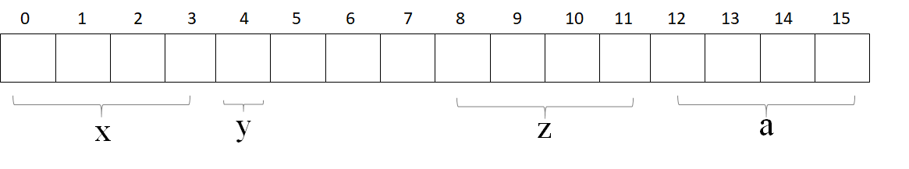

# 内存
## 1 结构体内存是如何进行对齐的？
 原则
- 结构体内成员按照声明顺序存储，第一个成员地址和整个结构体地址相同。
- 未特殊说明时，按结构体中size最大的成员对齐（若有double成员，按8字节对齐。）
c++11以后引入两个关键字 [alignas](https://zh.cppreference.com/w/cpp/language/alignas)与 [alignof](https://zh.cppreference.com/w/cpp/language/alignof)。其中`alignof`可以计算出类型的对齐方式，`alignas`可以指定结构体的对齐方式。
 案例
但是`alignas`在某些情况下是不能使用的，具体见下面的例子:
```cpp
// alignas 生效的情况
struct Info {
  uint8_t a;
  uint16_t b;
  uint8_t c;
};
std::cout << sizeof(Info) << std::endl;   // 6  2 + 2 + 2
std::cout << alignof(Info) << std::endl;  // 2
struct alignas(4) Info2 {
  uint8_t a;
  uint16_t b;
  uint8_t c;
};
std::cout << sizeof(Info2) << std::endl;   // 8  4 + 4
std::cout << alignof(Info2) << std::endl;  // 4
```
`alignas`将内存对齐调整为4个字节。所以`sizeof(Info2)`的值变为了8。
```cpp
// alignas 失效的情况
struct Info {
  uint8_t a;
  uint32_t b;
  uint8_t c;
};
std::cout << sizeof(Info) << std::endl;   // 12  4 + 4 + 4
std::cout << alignof(Info) << std::endl;  // 4
struct alignas(2) Info2 {
  uint8_t a;
  uint32_t b;
  uint8_t c;
};
std::cout << sizeof(Info2) << std::endl;   // 12  4 + 4 + 4
std::cout << alignof(Info2) << std::endl;  // 4
```
若`alignas`小于自然对齐的最小单位，则被忽略。
- 如果想使用单字节对齐的方式，使用`alignas`是无效的。应该使用`pragma pack(push,1)`或者使用`__attribute__((packed))`。
  ```cpp
  if defined(__GNUC__) || defined(__GNUG__)
    define ONEBYTE_ALIGN __attribute__((packed))
  elif defined(_MSC_VER)
    define ONEBYTE_ALIGN
    pragma pack(push,1)
  endif
  struct Info {
    uint8_t a;
    uint32_t b;
    uint8_t c;
  } ONEBYTE_ALIGN;
  if defined(__GNUC__) || defined(__GNUG__)
    undef ONEBYTE_ALIGN
  elif defined(_MSC_VER)
    pragma pack(pop)
    undef ONEBYTE_ALIGN
  endif
  std::cout << sizeof(Info) << std::endl;   // 6 1 + 4 + 1
  std::cout << alignof(Info) << std::endl;  // 1
  ```
- 确定结构体中每个元素大小可以通过下面这种方法:
  ```cpp
  if defined(__GNUC__) || defined(__GNUG__)
    define ONEBYTE_ALIGN __attribute__((packed))
  elif defined(_MSC_VER)
    define ONEBYTE_ALIGN
    pragma pack(push,1)
  endif
  /**
  * 0 1   3     6   8 9            15
  * +-+---+-----+---+-+-------------+
  * | |   |     |   | |             |
  * |a| b |  c  | d |e|     pad     |
  * | |   |     |   | |             |
  * +-+---+-----+---+-+-------------+
  */
  struct Info {
    uint16_t a : 1;
    uint16_t b : 2;
    uint16_t c : 3;
    uint16_t d : 2;
    uint16_t e : 1;
    uint16_t pad : 7;
  } ONEBYTE_ALIGN;
  if defined(__GNUC__) || defined(__GNUG__)
    undef ONEBYTE_ALIGN
  elif defined(_MSC_VER)
    pragma pack(pop)
    undef ONEBYTE_ALIGN
  endif
  std::cout << sizeof(Info) << std::endl;   // 2
  std::cout << alignof(Info) << std::endl;  // 1
  ```
  这种处理方式是`alignas`处理不了的。
## 2 new / delete 与 malloc / free的异同
 相同点
- 都可用于内存的动态申请和释放
 不同点
- 前者是C++运算符，后者是C/C++语言标准库函数
- new自动计算要分配的空间大小，malloc需要手工计算
- new是类型安全的，malloc不是。例如：
```cpp
int *p = new float[2]; //编译错误
int *p = (int*)malloc(2 * sizeof(double));//编译无错误
```
*  new调用名为**operator new**的标准库函数分配足够空间并调用相关对象的构造函数，delete对指针所指对象运行适当的析构函数；然后通过调用名为**operator delete**的标准库函数释放该对象所用内存。后者均没有相关调用
*  后者需要库文件支持，前者不用
*  new是封装了malloc，直接free不会报错，但是这只是释放内存，而不会析构对象 
 总结
- malloc和free是标准库函数，支持覆盖；new和delete是运算符，支持重载。
- malloc仅仅分配内存空间，free仅仅回收空间，不具备调用构造函数和析构函数功能，用malloc分配空间存储类的对象存在风险；new和delete除了分配回收功能外，还会调用构造函数和析构函数。
- malloc和free返回的是void类型指针（必须进行类型转换），new和delete返回的是具体类型指针。
## 3 new和delete是如何实现的？
  new的实现过程是
- 首先调用名为**operator new**的标准库函数，分配足够大的原始为类型化的内存，以保存指定类型的一个对象；
- 接下来运行该类型的一个构造函数，用指定初始化构造对象；
- 最后返回指向新分配并构造后的的对象的指针
  delete的实现过程
- 对指针指向的对象运行适当的析构函数；
- 然后通过调用名为**operator delete**的标准库函数释放该对象所用内存
## 4 既然有了malloc/free，C++中为什么还需要new/delete呢？直接用malloc/free不好吗？
 malloc/free和new/delete都是用来申请内存和回收内存的。
在对非基本数据类型的对象使用的时候，对象创建的时候还需要执行构造函数，销毁的时候要执行析构函数。而malloc/free是库函数，是已经编译的代码。
所以不能把构造函数和析构函数的功能强加给malloc/free，所以new/delete是必不可少的。
## 5 被free回收的内存是立即返还给操作系统吗？
不是的，被free回收的内存会首先被ptmalloc使用双链表保存起来，当用户下一次申请内存的时候，会尝试从这些内存中寻找合适的返回。这样就避免了频繁的系统调用，占用过多的系统资源。
同时ptmalloc也会尝试对小块内存进行合并，避免过多的内存碎片。
## 6 拷贝初始化和直接初始化
  当用于类类型对象时
初始化的拷贝形式和直接形式有所不同：直接初始化直接调用与实参匹配的构造函数，拷贝初始化总是调用拷贝构造函数。拷贝初始化首先使用指定构造函数创建一个临时对象，然后用拷贝构造函数将那个临时对象拷贝到正在创建的对象。举例如下
```cpp
string str1("I am a string");//语句1 直接初始化
string str2(str1);//语句2 直接初始化，str1是已经存在的对象，直接调用拷贝构造函数对str2进行初始化
string str3 = "I am a string";//语句3 拷贝初始化，先为字符串”I am a string“创建临时对象，再把临时对象作为参数，使用拷贝构造函数构造str3
string str4 = str1;//语句4 拷贝初始化，这里相当于隐式调用拷贝构造函数，而不是调用赋值运算符函数
```
 **为了提高效率，允许编译器跳过创建临时对象这一步，**直接调用构造函数构造要创建的对象，这样就完全等价于**直接初始化了**（语句1和语句3等价），但是需要辨别两种情况。
  - 当拷贝构造函数为private时：语句3和语句4在编译时会报错
  - 使用explicit修饰构造函数时：如果构造函数存在隐式转换，编译时会报错
## 7 静态变量什么时候初始化？
1)  初始化只有一次，但是可以多次赋值，在主程序之前，编译器已经为其分配好了内存。
2)  静态局部变量和全局变量一样，数据都存放在全局区域，所以在主程序之前，编译器已经为其分配好了内存，但在C和C++中静态局部变量的初始化节点又有点不太一样。在C中，初始化发生在代码执行之前，编译阶段分配好内存之后，就会进行初始化，所以我们看到在C语言中无法使用变量对静态局部变量进行初始化，在程序运行结束，变量所处的全局内存会被全部回收。
3)  而在C++中，初始化时在执行相关代码时才会进行初始化，主要是由于C++引入对象后，要进行初始化必须执行相应构造函数和析构函数，在构造函数或析构函数中经常会需要进行某些程序中需要进行的特定操作，并非简单地分配内存。所以C++标准定为全局或静态对象是有首次用到时才会进行构造，并通过atexit()来管理。在程序结束，按照构造顺序反方向进行逐个析构。所以在C++中是可以使用变量对静态局部变量进行初始化的。
## 8 从汇编层去解释一下引用
~~~cpp
9:      int x = 1;
00401048  mov     dword ptr [ebp-4],1
10:     int &b = x;
0040104F   lea     eax,[ebp-4]
00401052  mov     dword ptr [ebp-8],eax
~~~
x的地址为ebp-4，b的地址为ebp-8，因为栈内的变量内存是从高往低进行分配的，所以b的地址比x的低。
lea eax,[ebp-4] 这条语句将x的地址ebp-4放入eax寄存器
mov dword ptr [ebp-8],eax 这条语句将eax的值放入b的地址
ebp-8中上面两条汇编的作用即：将x的地址存入变量b中，这不和将某个变量的地址存入指针变量是一样的吗？
所以从汇编层次来看，的确引用是通过指针来实现的。
## 9 new和malloc的区别
1、 new/delete是C++关键字，需要编译器支持。malloc/free是库函数，需要头文件支持；
2、 使用new操作符申请内存分配时无须指定内存块的大小，编译器会根据类型信息自行计算。而malloc则需要显式地指出所需内存的尺寸。
3、 new操作符内存分配成功时，返回的是对象类型的指针，类型严格与对象匹配，无须进行类型转换，故new是符合类型安全性的操作符。而malloc内存分配成功则是返回void * ，需要通过强制类型转换将void*指针转换成我们需要的类型。
4、 new内存分配失败时，会抛出bac_alloc异常。malloc分配内存失败时返回NULL。
5、 new会先调用operator new函数，申请足够的内存（通常底层使用malloc实现）。然后调用类型的构造函数，初始化成员变量，最后返回自定义类型指针。delete先调用析构函数，然后调用operator delete函数释放内存（通常底层使用free实现）。malloc/free是库函数，只能动态的申请和释放内存，无法强制要求其做自定义类型对象构造和析构工作。
## 10 delete p、delete [] p、allocator都有什么作用？
1、 动态数组管理new一个数组时，[]中必须是一个整数，但是不一定是常量整数，普通数组必须是一个常量整数；
2、 new动态数组返回的并不是数组类型，而是一个元素类型的指针；
3、 delete[]时，数组中的元素按逆序的顺序进行销毁；
4、 new在内存分配上面有一些局限性，new的机制是将内存分配和对象构造组合在一起，同样的，delete也是将对象析构和内存释放组合在一起的。allocator将这两部分分开进行，allocator申请一部分内存，不进行初始化对象，只有当需要的时候才进行初始化操作。
## 11 new和delete的实现原理， delete是如何知道释放内存的大小的？
1、 new简单类型直接调用operator new分配内存；
而对于复杂结构，先调用operator new分配内存，然后在分配的内存上调用构造函数；
对于简单类型，new[]计算好大小后调用operator new；
对于复杂数据结构，new[]先调用operator new[]分配内存，然后在p的前四个字节写入数组大小n，然后调用n次构造函数，针对复杂类型，new[]会额外存储数组大小；
①   new表达式调用一个名为operator new(operator new[])函数，分配一块足够大的、原始的、未命名的内存空间；
②   编译器运行相应的构造函数以构造这些对象，并为其传入初始值；
③   对象被分配了空间并构造完成，返回一个指向该对象的指针。
2、 delete简单数据类型默认只是调用free函数；复杂数据类型先调用析构函数再调用operator delete；针对简单类型，delete和delete[]等同。假设指针p指向new[]分配的内存。因为要4字节存储数组大小，实际分配的内存地址为[p-4]，系统记录的也是这个地址。delete[]实际释放的就是p-4指向的内存。而delete会直接释放p指向的内存，这个内存根本没有被系统记录，所以会崩溃。
3、 需要在 new [] 一个对象数组时，需要保存数组的维度，C++ 的做法是在分配数组空间时多分配了 4 个字节的大小，专门保存数组的大小，在 delete [] 时就可以取出这个保存的数，就知道了需要调用析构函数多少次了。
## 12 malloc申请的存储空间能用delete释放吗?
**不能**，malloc /free主要为了兼容C，new和delete 完全可以取代malloc /free的。
malloc /free的操作对象都是必须明确大小的，而且不能用在动态类上。
new 和delete会自动进行类型检查和大小，malloc/free不能执行构造函数与析构函数，所以动态对象它是不行的。
当然从理论上说使用malloc申请的内存是可以通过delete释放的。
不过一般不这样写的。而且也不能保证每个C++的运行时都能正常。
## 13 malloc与free的实现原理？
1、 在标准C库中，提供了malloc/free函数分配释放内存，这两个函数底层是由brk、mmap、，munmap这些系统调用实现的;
2、 brk是将「堆顶」指针向高地址移动，获得新的内存空间,mmap是在进程的虚拟地址空间中（堆和栈中间，称为文件映射区域的地方）找一块空闲的虚拟内存。这两种方式分配的都是虚拟内存，没有分配物理内存。在第一次访问已分配的虚拟地址空间的时候，发生缺页中断，操作系统负责分配物理内存，然后建立虚拟内存和物理内存之间的映射关系；
3、 malloc小于128k的内存，使用brk分配内存，将「堆顶」指针往高地址推；malloc大于128k的内存，使用mmap分配内存，在堆和栈之间找一块空闲内存分配；brk分配的内存需要等到高地址内存释放以后才能释放，而mmap分配的内存可以单独释放。当最高地址空间的空闲内存超过128K（可由M_TRIM_THRESHOLD选项调节）时，执行内存紧缩操作（trim）。在上一个步骤free的时候，发现最高地址空闲内存超过128K，于是内存紧缩。
4、 malloc是从堆里面申请内存，也就是说函数返回的指针是指向堆里面的一块内存。操作系统中有一个记录空闲内存地址的链表。当操作系统收到程序的申请时，就会遍历该链表，然后就寻找第一个空间大于所申请空间的堆结点，然后就将该结点从空闲结点链表中删除，并将该结点的空间分配给程序。
## 14 malloc、realloc、calloc的区别
    1)   malloc函数
~~~cpp
void* malloc(unsigned int num_size);
int *p = malloc(20*sizeof(int));申请20个int类型的空间；
~~~
    2)   calloc函数
~~~cpp
void* calloc(size_t n,size_t size);
int *p = calloc(20, sizeof(int));
~~~
省去了人为空间计算；malloc申请的空间的值是随机初始化的，calloc申请的空间的值是初始化为0的；
    3)   realloc函数
~~~cpp
void realloc(void *p, size_t new_size);
~~~
给动态分配的空间分配额外的空间，用于扩充容量。
## 15 什么是内存泄露，如何检测与避免
 **内存泄露**
一般我们常说的内存泄漏是指**堆内存的泄漏**。堆内存是指程序从堆中分配的，大小任意的(内存块的大小可以在程序运行期决定)内存块，使用完后必须显式释放的内存。应用程序般使用malloc,、realloc、 new等函数从堆中分配到块内存，使用完后，程序必须负责相应的调用free或delete释放该内存块，否则，这块内存就不能被再次使用，我们就说这块内存泄漏了
  **避免内存泄露的几种方式**
- 计数法：使用new或者malloc时，让该数+1，delete或free时，该数-1，程序执行完打印这个计数，如果不为0则表示存在内存泄露
- 一定要将基类的析构函数声明为**虚函数**
- 对象数组的释放一定要用**delete []**
- 有new就有delete，有malloc就有free，保证它们一定成对出现
  **检测工具**
- Linux下可以使用**Valgrind工具**
- Windows下可以使用**CRT库**
## 16 对象复用的了解，零拷贝的了解
  **对象复用**
对象复用其本质是一种设计模式：Flyweight享元模式。
通过将对象存储到“对象池”中实现对象的重复利用，这样可以避免多次创建重复对象的开销，节约系统资源。
  **零拷贝**
零拷贝就是一种避免 CPU 将数据从一块存储拷贝到另外一块存储的技术。
零拷贝技术可以减少数据拷贝和共享总线操作的次数。
在C++中，vector的一个成员函数**emplace_back()**很好地体现了零拷贝技术，它跟push_back()函数一样可以将一个元素插入容器尾部，区别在于：**使用push_back()函数需要调用拷贝构造函数和转移构造函数，而使用emplace_back()插入的元素原地构造，不需要触发拷贝构造和转移构造**，效率更高。举个例子：
```cpp
include <vector>
include <string>
include <iostream>
using namespace std;
struct Person
{
    string name;
    int age;
    //初始构造函数
    Person(string p_name, int p_age): name(std::move(p_name)), age(p_age)
    {
         cout << "I have been constructed" <<endl;
    }
     //拷贝构造函数
     Person(const Person& other): name(std::move(other.name)), age(other.age)
    {
         cout << "I have been copy constructed" <<endl;
    }
     //转移构造函数
     Person(Person&& other): name(std::move(other.name)), age(other.age)
    {
         cout << "I have been moved"<<endl;
    }
};
int main()
{
    vector<Person> e;
    cout << "emplace_back:" <<endl;
    e.emplace_back("Jane", 23); //不用构造类对象
    vector<Person> p;
    cout << "push_back:"<<endl;
    p.push_back(Person("Mike",36));
    return 0;
}
//输出结果：
//emplace_back:
//I have been constructed
//push_back:
//I have been constructed
//I am being moved.
```
 74、如何获得结构成员相对于结构开头的字节偏移量
使用<stddef.h>头文件中的，offsetof宏。
  举个例子
```cpp
include <iostream>
include <stddef.h>
using namespace std;
struct  S
{
    int x;
    char y;
    int z;
    double a;
};
int main()
{
    cout << offsetof(S, x) << endl; // 0
    cout << offsetof(S, y) << endl; // 4
    cout << offsetof(S, z) << endl; // 8
    cout << offsetof(S, a) << endl; // 12
    return 0;
}
```
在Visual Studio 2019 + Win10 下的输出情况如下
```cpp
cout << offsetof(S, x) << endl; // 0
cout << offsetof(S, y) << endl; // 4
cout << offsetof(S, z) << endl; // 8
cout << offsetof(S, a) << endl; // 16 这里是 16的位置，因为 double是8字节，需要找一个8的倍数对齐，
```
当然了，如果加上  pragma pack(4) 指定4字节对齐方式就可以了。
```cpp
pragma pack(4)
struct  S
{
    int x;
    char y;
    int z;
    double a;
};
void test02()
{
cout << offsetof(S, x) << endl; // 0
cout << offsetof(S, y) << endl; // 4
cout << offsetof(S, z) << endl; // 8
cout << offsetof(S, a) << endl; // 12
｝
```
S结构体中各个数据成员的内存空间划分如下所示，需要注意内存对齐

 82、类如何实现只能静态分配和只能动态分配
1)  前者是把new、delete运算符重载为private属性。后者是把构造、析构函数设为protected属性，再用子类来动态创建
2)  建立类的对象有两种方式：
- ①   静态建立，静态建立一个类对象，就是由编译器为对象在栈空间中分配内存；
- ②   动态建立，A *p = new A();动态建立一个类对象，就是使用new运算符为对象在堆空间中分配内存。这个过程分为两步，第一步执行operator new()函数，在堆中搜索一块内存并进行分配；第二步调用类构造函数构造对象；
3)  只有使用new运算符，对象才会被建立在堆上，因此只要限制new运算符就可以实现类对象只能建立在栈上，可以将new运算符设为私有.
## 17 说一说你理解的内存对齐以及原因
1、 分配内存的顺序是按照声明的顺序。
2、 每个变量相对于起始位置的偏移量必须是该变量类型大小的整数倍，不是整数倍空出内存，直到偏移量是整数倍为止。
3、 最后整个结构体的大小必须是里面变量类型最大值的整数倍。
添加了pragma pack(n)后规则就变成了下面这样：
1、 偏移量要是n和当前变量大小中较小值的整数倍
2、 整体大小要是n和最大变量大小中较小值的整数倍
3、 n值必须为1,2,4,8…，为其他值时就按照默认的分配规则
## 18 你知道strcpy和memcpy的区别是什么吗？
 1、复制的内容不同。
strcpy只能复制字符串，而memcpy可以复制任意内容，例如字符数组、整型、结构体、类等。
  2、复制的方法不同。
strcpy不需要指定长度，它遇到被复制字符的串结束符"\0"才结束，所以容易溢出。memcpy则是根据其第3个参数决定复制的长度。
  3、用途不同。
通常在复制字符串时用strcpy，而需要复制其他类型数据时则一般用memcpy
## 19 说一说strcpy、sprintf与memcpy这三个函数的不同之处
    1)  操作对象不同
①   strcpy的两个操作对象均为字符串 
②   sprintf的操作源对象可以是多种数据类型，目的操作对象是字符串 
③   memcpy的两个对象就是两个任意可操作的内存地址，并不限于何种数据类型。
        2)  执行效率不同
memcpy最高，strcpy次之，sprintf的效率最低。
            3)  实现功能不同
①   strcpy主要实现字符串变量间的拷贝 
②   sprintf主要实现其他数据类型格式到字符串的转化 
③   memcpy主要是内存块间的拷贝。
## 20 strcpy函数和strncpy函数的区别？哪个函数更安全？
 函数原型
~~~cpp
char* strcpy(char* strDest, const char* strSrc)
char *strncpy(char *dest, const char *src, size_t n)
~~~
  strcpy函数
如果参数 dest 所指的内存空间不够大，可能会造成缓冲溢出(buffer Overflow)的错误情况，在编写程序时请特别留意，或者用strncpy()来取代。 
 strncpy函数
用来复制源字符串的前n个字符，src 和 dest 所指的内存区域不能重叠，且 dest 必须有足够的空间放置n个字符。 
 补充
- 如果目标长>指定长>源长，则将源长全部拷贝到目标长，自动加上’\0’  
- 如果指定长<源长，则将源长中按指定长度拷贝到目标字符串，不包括’\0’ 
- 如果指定长>目标长，运行时错误 ；
## 21 常见内存分配内存错误
 （1）内存分配未成功，却使用了它。
编程新手常犯这种错误，因为他们没有意识到内存分配会不成功。常用解决办法是，在使用内存之前检查指针是否为NULL。如果指针p是函数的参数，那么在函数的入口处用assert(p!=NULL)进行检查。如果是用malloc或new来申请内存，应该用if(p==NULL) 或if(p!=NULL)进行防错处理。
 （2）内存分配虽然成功，但是尚未初始化就引用它。
犯这种错误主要有两个起因：一是没有初始化的观念；二是误以为内存的缺省初值全为零，导致引用初值错误（例如数组）。内存的缺省初值究竟是什么并没有统一的标准，尽管有些时候为零值，我们宁可信其无不可信其有。所以无论用何种方式创建数组，都别忘了赋初值，即便是赋零值也不可省略，不要嫌麻烦。
 （3）内存分配成功并且已经初始化，但操作越过了内存的边界。
例如在使用数组时经常发生下标“多1”或者“少1”的操作。特别是在for循环语句中，循环次数很容易搞错，导致数组操作越界。
 （4）忘记了释放内存，造成内存泄露。
含有这种错误的函数每被调用一次就丢失一块内存。刚开始时系统的内存充足，你看不到错误。终有一次程序突然挂掉，系统出现提示：内存耗尽。动态内存的申请与释放必须配对，程序中malloc与free的使用次数一定要相同，否则肯定有错误（new/delete同理）。
 （5）释放了内存却继续使用它。常见于以下有三种情况：
- 程序中的对象调用关系过于复杂，实在难以搞清楚某个对象究竟是否已经释放了内存，此时应该重新设计数据结构，从根本上解决对象管理的混乱局面。
- 函数的return语句写错了，注意不要返回指向“栈内存”的“指针”或者“引用”，因为该内存在函数体结束时被自动销毁。
- 使用free或delete释放了内存后，没有将指针设置为NULL。导致产生“野指针”。
## 22 一个由C/C++编译的程序占用的内存分为哪几个部分？
1、栈区（stack）— 地址向下增长，由编译器自动分配释放，存放函数的参数值，局部变量的值等。其操作方式类似于数据结构中的数据结构中的栈，先进后出。
2、堆区（heap）— 地址向上增长，一般由程序员分配释放，若程序员不释放，程序结束时可能由OS回收。注意它与数据结构中的堆是两回事，分配方式倒是类似于链表。
3、全局区（静态区）（static）—全局变量和静态变量的存储是放在一块的，初始化的全局变量和静态变量在一块区域，未初始化的全局变量和未初始化的静态变量在相邻的另一块区域。 - 程序结束后有系统释放
4、文字常量区 —常量字符串就是放在这里的。程序结束后由系统释放
5、程序代码区(text)—存放函数体的二进制代码。 
## 23 讲一下程序的内存分区/内存模型？
内存分区，分别是堆、栈、自由存储区、全局/静态存储区、常量存储区和代码区。如下图所示

**栈**：在执行函数时，函数内局部变量的存储单元都可以在栈上创建，函数执行结束时这些存储单元自动被释放。栈内存分配运算内置于处理器的指令集中，效率很高，但是分配的内存容量有限
**堆**：就是那些由 `new`分配的内存块，他们的释放编译器不去管，由我们的应用程序去控制，一般一个`new`就要对应一个 `delete`。如果程序员没有释放掉，那么在程序结束后，操作系统会自动回收
**自由存储区**：如果说堆是操作系统维护的一块内存，那么自由存储区就是C++中通过new和delete动态分配和释放对象的抽象概念。需要注意的是，自由存储区和堆比较像，但不等价。
**全局/静态存储区**：全局变量和静态变量被分配到同一块内存中，在以前的C语言中，全局变量和静态变量又分为初始化的和未初始化的，在C++里面没有这个区分了，它们共同占用同一块内存区，在该区定义的变量若没有初始化，则会被自动初始化，例如int型变量自动初始为0
**常量存储区**：这是一块比较特殊的存储区，这里面存放的是常量，不允许修改
**代码区**：存放函数体的二进制代码
## 24 C++中类的数据成员和成员函数内存分布情况
C++类是由结构体发展得来的，所以他们的成员变量（C语言的结构体只有成员变量）的内存分配机制是一样的。下面我们以类来说明问题，如果类的问题通了，结构体也也就没问题啦。 类分为成员变量和成员函数，我们先来讨论成员变量。 
一个类对象的地址就是类所包含的这一片内存空间的首地址，这个首地址也就对应具体某一个成员变量的地址。（在定义类对象的同时这些成员变量也就被定义了），举个例子：
```cpp
include <iostream>
using namespace std;
class Person
{
public:
    Person()
    {
        this->age = 23;
    }
    void printAge()
    {
        cout << this->age <<endl;
    }
    ~Person(){}
public:
    int age;
};
int main()
{
    Person p;
    cout << "对象地址："<< &p <<endl;
    cout << "age地址："<< &(p.age) <<endl;
    cout << "对象大小："<< sizeof(p) <<endl;
    cout << "age大小："<< sizeof(p.age) <<endl;
    return 0;
}
//输出结果
//对象地址：0x7fffec0f15a8
//age地址：0x7fffec0f15a8
//对象大小：4
//age大小：4
```
从代码运行结果来看，对象的大小和对象中数据成员的大小是一致的，也就是说，成员函数不占用对象的内存。这是因为所有的函数都是存放在代码区的，不管是全局函数，还是成员函数。
要是成员函数占用类的对象空间，那么将是多么可怕的事情：定义一次类对象就有成员函数占用一段空间。 
我们再来补充一下静态成员函数的存放问题：**静态成员函数与一般成员函数的唯一区别就是没有this指针**，因此不能访问非静态数据成员。
就像我前面提到的，**所有函数都存放在代码区，静态函数也不例外。所有有人一看到 static 这个单词就主观的认为是存放在全局数据区，那是不对的。**
## 25 内存泄漏的后果？如何监测？解决方法？
**1)  内存泄漏**
内存泄漏是指由于疏忽或错误造成了程序未能释放掉不再使用的内存的情况。内存泄漏并非指内存在物理上消失，而是应用程序分配某段内存后，由于设计错误，失去了对该段内存的控制；
**2)  后果**
只发生一次小的内存泄漏可能不被注意，但泄漏大量内存的程序将会出现各种证照：性能下降到内存逐渐用完，导致另一个程序失败；
**3)  如何排除**
使用工具软件BoundsChecker，BoundsChecker是一个运行时错误检测工具，它主要定位程序运行时期发生的各种错误；
调试运行DEBUG版程序，运用以下技术：CRT(C run-time libraries)、运行时函数调用堆栈、内存泄漏时提示的内存分配序号(集成开发环境OUTPUT窗口)，综合分析内存泄漏的原因，排除内存泄漏。
**4)  解决方法**
智能指针。
**5)  检查、定位内存泄漏**
检查方法：在main函数最后面一行，加上一句\_CrtDumpMemoryLeaks()。调试程序，自然关闭程序让其退出，查看输出：
输出这样的格式{453}normal block at 0x02432CA8,868 bytes long
被{}包围的453就是我们需要的内存泄漏定位值，868 bytes long就是说这个地方有868比特内存没有释放。
定位代码位置
在main函数第一行加上\_CrtSetBreakAlloc(453);意思就是在申请453这块内存的位置中断。然后调试程序，程序中断了，查看调用堆栈。加上头文件include <crtdbg.h>

## 26 讲讲new的实现，其中new什么时候返回空指针，什么时候抛出异常，抛的是什么异常？
 new的实现
new操作符用于在堆上分配内存并调用构造函数来初始化对象。它的实现通常包括以下几个步骤：
- 首先，它会根据传入的参数计算需要分配的内存大小。
- 然后，它会尝试分配这段内存。
- 如果内存分配成功，new会调用相应类型的构造函数初始化对象。
- 最后，它会返回指向分配内存的指针。
 new返回空指针的情况
 当内存分配失败时，new会返回一个空指针（nullptr）。这通常是由于内存不足或者操作系统无法满足分配请求引起的。在这种情况下，可以使用try-catch语句来捕获异常或者检查返回的指针是否为空，以便采取适当的处理措施。
  new抛出异常的情况
 在标准的C++中，new操作符在内存分配失败时会抛出std::bad_alloc异常。这是一个派生自std::exception的异常类，用于表示内存分配失败的情况。当new无法分配所需内存时，它会抛出此异常，以便在异常处理机制下进行适当的处理。
 需要注意的是，这些问题的回答可能因为特定的C++标准、编译器或操作系统的差异而有所不同。因此，求职者的回答应该尽量考虑这些因素，并提供准确的信息。
