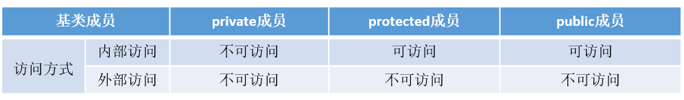

# 面向对象
## 1 C++有哪几种的构造函数？
C++中的构造函数可以分为4类：
- 默认构造函数
- 初始化构造函数（有参数）
- 拷贝构造函数
- 移动构造函数（move和右值引用）
- 委托构造函数
- 转换构造函数
举个例子：
```cpp
include <iostream>
using namespace std;
class Student{
public:
    Student(){//默认构造函数，没有参数
        this->age = 20;
        this->num = 1000;
    };  
    Student(int a, int n):age(a), num(n){}; //初始化构造函数，有参数和参数列表
    Student(const Student& s){//拷贝构造函数，这里与编译器生成的一致
        this->age = s.age;
        this->num = s.num;
    }; 
    Student(int r){   //转换构造函数,形参是其他类型变量，且只有一个形参
        this->age = r;
        this->num = 1002;
    };
    ~Student(){}
public:
    int age;
    int num;
};
int main(){
    Student s1;
    Student s2(18,1001);
    int a = 10;
    Student s3(a);
    Student s4(s3);
    
    printf("s1 age:%d, num:%d\n", s1.age, s1.num);
    printf("s2 age:%d, num:%d\n", s2.age, s2.num);
    printf("s3 age:%d, num:%d\n", s3.age, s3.num);
    printf("s2 age:%d, num:%d\n", s4.age, s4.num);
    return 0;
}
//运行结果
//s1 age:20, num:1000
//s2 age:18, num:1001
//s3 age:10, num:1002
//s2 age:10, num:1002
```
- 默认构造函数和初始化构造函数在定义类的对象，完成对象的初始化工作
- 复制构造函数用于复制本类的对象
- 转换构造函数用于将其他类型的变量，隐式转换为本类对象
## 2 public，protected和private访问和继承权限/public/protected/private的区别？
- public的变量和函数在类的内部外部都可以访问。
- protected的变量和函数只能在类的内部和其派生类中访问。
- private修饰的元素只能在类内访问。
 （一）访问权限
 派生类可以继承基类中除了构造/析构、赋值运算符重载函数之外的成员，但是这些成员的访问属性在派生过程中也是可以调整的，三种派生方式的访问权限如下表所示：注意外部访问并不是真正的外部访问，而是在通过派生类的对象对基类成员的访问。
 
 派生类对基类成员的访问形象有如下两种：
- 内部访问：由派生类中新增的成员函数对从基类继承来的成员的访问
- **外部访问**：在派生类外部，通过派生类的对象对从基类继承来的成员的访问
 （二）继承权限
 **public继承**
 公有继承的特点是基类的公有成员和保护成员作为派生类的成员时，都保持原有的状态，而基类的私有成员任然是私有的，不能被这个派生类的子类所访问
 **protected继承**
 保护继承的特点是基类的所有公有成员和保护成员都成为派生类的保护成员，并且只能被它的派生类成员函数或友元函数访问，基类的私有成员仍然是私有的，访问规则如下表
 
 **private继承**
 私有继承的特点是基类的所有公有成员和保护成员都成为派生类的私有成员，并不被它的派生类的子类所访问，基类的成员只能由自己派生类访问，无法再往下继承，访问规则如下表
 
> update1：感谢微信好友“李宇杰”指出方式二中代码错误，感谢。
 **总结**
 一、访问权限
| 访问权限  | 外部 | 派生类 | 内部 |
| --------- | ---- | ------ | ---- |
| public    | ✔    | ✔      | ✔    |
| protected | ❌    | ✔      | ✔    |
| private   | ❌    | ❌      | ✔    |
public、protected、private 的访问权限范围关系：
public > protected > private
 二、继承权限
1. 派生类继承自基类的成员权限有四种状态：public、protected、private、不可见，排序为 public > protected > private
2. 派生类对基类成员的访问权限取决于两点：一、继承方式；二、基类成员在基类中的访问权限
3. 基类成员在派生类中的访问权限不得高于继承方式中指定的权限，高于继承方式中指定的权限则下降为继承权限，低于继承权限则不调整，**基类 private 成员在任何继承方式下都是不可见的**。例如：
- public 继承 + private 成员 => 不可见 
- public 继承 +  protected 成员 => protected
- protected 继承 + public 成员 => protected
- private 继承 + protected 成员 => private
- private 继承 + public 成员 => private
## 3 什么情况下会调用拷贝构造函数
  场景
- 用类的一个实例化对象去初始化另一个对象的时候
- 函数的参数是类的对象时（非引用传递）
- 函数的返回值是函数体内局部对象的类的对象时 ,此时虽然发生（Named return Value优化）NRV优化，但是由于返回方式是值传递，所以会在返回值的地方调用拷贝构造函数
另：第三种情况在Linux g++ 下则不会发生拷贝构造函数，不仅如此即使返回局部对象的引用，依然不会发生拷贝构造函数
**总结就是：即使发生NRV优化的情况下，Linux+ g++的环境是不管值返回方式还是引用方式返回的方式都不会发生拷贝构造函数，而Windows + VS2019在值返回的情况下发生拷贝构造函数，引用返回方式则不发生拷贝构造函数**。
在c++编译器发生NRV优化，如果是引用返回的形式则不会调用拷贝构造函数，如果是值传递的方式依然会发生拷贝构造函数。
  <sub></sub>**在VS2019下进行下述实验：**
举个例子：
```cpp
class A
{
public:
    A() {};
    A(const A& a)
    {
        cout << "copy constructor is called" << endl;
    };
    ~A() {};
};
void useClassA(A a) {}
A getClassA()//此时会发生拷贝构造函数的调用，虽然发生NRV优化，但是依然调用拷贝构造函数
{
    A a;
    return a;
}
//A& getClassA2()//  VS2019下，此时编辑器会进行（Named return Value优化）NRV优化,不调用拷贝构造函数 ，如果是引用传递的方式返回当前函数体内生成的对象时，并不发生拷贝构造函数的调用
//{
//  A a;
//  return a;
//}
int main()
{
    A a1,a3,a4;
    A a2 = a1;  //调用拷贝构造函数,对应情况1
    useClassA(a1);//调用拷贝构造函数，对应情况2
    a3 = getClassA();//发生NRV优化，但是值返回，依然会有拷贝构造函数的调用 情况3
    a4 = getClassA2(a1);//发生NRV优化，且引用返回自身，不会调用
    return 0;
}
```
情况1比较好理解
情况2的实现过程是，调用函数时先根据传入的实参产生临时对象，再用拷贝构造去初始化这个临时对象，在函数中与形参对应，函数调用结束后析构临时对象
情况3在执行return时，理论的执行过程是：产生临时对象，调用拷贝构造函数把返回对象拷贝给临时对象，函数执行完先析构局部变量，再析构临时对象，  依然会调用拷贝构造函数
## 4 什么是类的继承？
    1) 类与类之间的关系
     has-A包含关系，用以描述一个类由多个部件类构成，实现has-A关系用类的成员属性表示，即一个类的成员属性是另一个已经定义好的类；
     use-A，一个类使用另一个类，通过类之间的成员函数相互联系，定义友元或者通过传递参数的方式来实现；
     is-A，继承关系，关系具有传递性；
        2) 继承的相关概念
          所谓的继承就是一个类继承了另一个类的属性和方法，这个新的类包含了上一个类的属性和方法，被称为子类或者派生类，被继承的类称为父类或者基类；
            3) 继承的特点
               子类拥有父类的所有属性和方法，子类可以拥有父类没有的属性和方法，子类对象可以当做父类对象使用；
                4) 继承中的访问控制
                    public、protected、private
                    5) 继承中的构造和析构函数
                              6) 继承中的兼容性原则
## 5 类成员初始化方式？构造函数的执行顺序 ？为什么用成员初始化列表会快一些？
1)  赋值初始化，通过在函数体内进行赋值初始化；列表初始化，在冒号后使用初始化列表进行初始化。
这两种方式的主要区别在于：
对于在函数体中初始化,是在所有的数据成员被分配内存空间后才进行的。
列表初始化是给数据成员分配内存空间时就进行初始化,就是说分配一个数据成员只要冒号后有此数据成员的赋值表达式(此表达式必须是括号赋值表达式),那么分配了内存空间后在进入函数体之前给数据成员赋值，就是说初始化这个数据成员此时函数体还未执行。 
2)  一个派生类构造函数的执行顺序如下：
①   虚拟基类的构造函数（多个虚拟基类则按照继承的顺序执行构造函数）。
②   基类的构造函数（多个普通基类也按照继承的顺序执行构造函数）。
③   类类型的成员对象的构造函数（按照成员对象在类中的定义顺序）
④   派生类自己的构造函数。
3)  方法一是在构造函数当中做赋值的操作，而方法二是做纯粹的初始化操作。我们都知道，C++的赋值操作是会产生临时对象的。临时对象的出现会降低程序的效率。
## 6 有哪些情况必须用到成员列表初始化？作用是什么？
    1)  必须使用成员初始化的四种情况
①    当初始化一个引用成员时；
②    当初始化一个常量成员时；
③    当调用一个基类的构造函数，而它拥有一组参数时；
④    当调用一个成员类的构造函数，而它拥有一组参数时；
        2)  成员初始化列表做了什么
①    编译器会一一操作初始化列表，以适当的顺序在构造函数之内安插初始化操作，并且在任何显示用户代码之前；
②    list中的项目顺序是由类中的成员声明顺序决定的，不是由初始化列表的顺序决定的；
## 7 成员初始化列表的概念，为什么用它会快一些？
  **成员初始化列表的概念**
在类的构造函数中，不在函数体内对成员变量赋值，而是在构造函数的花括号前面使用冒号和初始化列表赋值
  **效率**
用初始化列表会快一些的原因是，对于类型，它少了一次调用构造函数的过程，而在函数体中赋值则会多一次调用。而对于内置数据类型则没有差别。举个例子：
```cpp
include <iostream>
using namespace std;
class A
{
public:
    A()
    {
        cout << "默认构造函数A()" << endl;
    }
    A(int a)
    {
        value = a;
        cout << "A(int "<<value<<")" << endl;
    }
    A(const A& a)
    {
        value = a.value;
        cout << "拷贝构造函数A(A& a):  "<<value << endl;
    }
    int value;
};
class B
{
public:
    B() : a(1)
    {
        b = A(2);
    }
    A a;
    A b;
};
int main()
{
    B b;
}
//输出结果：
//A(int 1)
//默认构造函数A()
//A(int 2)
```
从代码运行结果可以看出，在构造函数体内部初始化的对象b多了一次构造函数的调用过程，而对象a则没有。
由于对象成员变量的初始化动作发生在进入构造函数之前，对于内置类型没什么影响，但**如果有些成员是类**，那么在进入构造函数之前，会先调用一次默认构造函数，进入构造函数后所做的事其实是一次赋值操作(对象已存在)，所以**如果是在构造函数体内进行赋值的话，等于是一次默认构造加一次赋值，而初始化列表只做一次赋值操作。**
## 8 说说移动构造函数
 1
1)  我们用对象a初始化对象b，后对象a我们就不在使用了，但是对象a的空间还在呀（在析构之前），既然拷贝构造函数，实际上就是把a对象的内容复制一份到b中，那么为什么我们不能直接使用a的空间呢？这样就避免了新的空间的分配，大大降低了构造的成本。这就是移动构造函数设计的初衷；
     2
2)  拷贝构造函数中，对于指针，我们一定要采用深层复制，而移动构造函数中，对于指针，我们采用浅层复制。浅层复制之所以危险，是因为两个指针共同指向一片内存空间，若第一个指针将其释放，另一个指针的指向就不合法了。所以我们只要避免第一个指针释放空间就可以了。避免的方法就是将第一个指针（比如a->value）置为NULL，这样在调用析构函数的时候，由于有判断是否为NULL的语句，所以析构a的时候并不会回收a->value指向的空间；
 3
3)  移动构造函数的参数和拷贝构造函数不同，拷贝构造函数的参数是一个左值引用，但是移动构造函数的初值是一个右值引用。意味着，移动构造函数的参数是一个右值或者将亡值的引用。也就是说，只用用一个右值，或者将亡值初始化另一个对象的时候，才会调用移动构造函数。而那个move语句，就是将一个左值变成一个将亡值。
## 9 如果想将某个类用作基类，为什么该类必须定义而非声明？
派生类中包含并且可以使用它从基类继承而来的成员，为了使用这些成员，派生类必须知道他们是什么。
所以必须定义而非声明。
## 10 继承机制中对象之间如何转换？指针和引用之间如何转换？
    1)     向上类型转换
将派生类指针或引用转换为基类的指针或引用被称为向上类型转换，向上类型转换会自动进行，而且向上类型转换是安全的。
        2)     向下类型转换
将基类指针或引用转换为派生类指针或引用被称为向下类型转换，向下类型转换不会自动进行，因为一个基类对应几个派生类，所以向下类型转换时不知道对应哪个派生类，所以在向下类型转换时必须加动态类型识别技术。RTTI技术，用dynamic_cast进行向下类型转换。
## 11 知道C++中的组合吗？它与继承相比有什么优缺点吗？
  **一：继承**
继承是Is a 的关系，比如说Student继承Person,则说明Student is a Person。继承的优点是子类可以重写父类的方法来方便地实现对父类的扩展。
继承的缺点有以下几点：
①：父类的内部细节对子类是可见的。
②：子类从父类继承的方法在编译时就确定下来了，所以无法在运行期间改变从父类继承的方法的行为。
③：如果对父类的方法做了修改的话（比如增加了一个参数），则子类的方法必须做出相应的修改。所以说子类与父类是一种高耦合，违背了面向对象思想。
  **二：组合**
组合也就是设计类的时候把要组合的类的对象加入到该类中作为自己的成员变量。
组合的优点：
①：当前对象只能通过所包含的那个对象去调用其方法，所以所包含的对象的内部细节对当前对象时不可见的。
②：当前对象与包含的对象是一个低耦合关系，如果修改包含对象的类中代码不需要修改当前对象类的代码。
③：当前对象可以在运行时动态的绑定所包含的对象。可以通过set方法给所包含对象赋值。
组合的缺点：①：容易产生过多的对象。②：为了能组合多个对象，必须仔细对接口进行定义。
## 12 为什么模板类一般都是放在一个h文件中
 1
 模板定义很特殊。由template<…>处理的任何东西都意味着编译器在当时不为它分配存储空间，它一直处于等待状态直到被一个模板实例告知。在编译器和连接器的某一处，有一机制能去掉指定模板的多重定义。
所以为了容易使用，几乎总是在头文件中放置全部的模板声明和定义。
 2
在分离式编译的环境下，编译器编译某一个.cpp文件时并不知道另一个.cpp文件的存在，也不会去查找（当遇到未决符号时它会寄希望于连接器）。这种模式在没有模板的情况下运行良好，但遇到模板时就傻眼了，因为模板仅在需要的时候才会实例化出来。
所以，当编译器只看到模板的声明时，它不能实例化该模板，只能创建一个具有外部连接的符号并期待连接器能够将符号的地址决议出来。
然而当实现该模板的.cpp文件中没有用到模板的实例时，编译器懒得去实例化，所以，整个工程的.obj中就找不到一行模板实例的二进制代码，于是连接器也黔驴技穷了。
## 13 C++中类成员的访问权限和继承权限问题
    1)  三种访问权限
①   public:用该关键字修饰的成员表示公有成员，该成员不仅可以在类内可以被  访问，在类外也是可以被访问的，是类对外提供的可访问接口；
②   private:用该关键字修饰的成员表示私有成员，该成员仅在类内可以被访问，在类体外是隐藏状态；
③   protected:用该关键字修饰的成员表示保护成员，保护成员在类体外同样是隐藏状态，但是对于该类的派生类来说，相当于公有成员，在派生类中可以被访问。
        2)  三种继承方式
①   若继承方式是public，基类成员在派生类中的访问权限保持不变，也就是说，基类中的成员访问权限，在派生类中仍然保持原来的访问权限；
②  若继承方式是private，基类所有成员在派生类中的访问权限都会变为私有(private)权限；
③  若继承方式是protected，基类的共有成员和保护成员在派生类中的访问权限都会变为保护(protected)权限，私有成员在派生类中的访问权限仍然是私有(private)权限。
## 14 你知道重载运算符吗？
1、 我们只能重载已有的运算符，而无权发明新的运算符；对于一个重载的运算符，其优先级和结合律与内置类型一致才可以；不能改变运算符操作数个数；
2、  两种重载方式：成员运算符和非成员运算符，成员运算符比非成员运算符少一个参数；下标运算符、箭头运算符必须是成员运算符；
3、 引入运算符重载，是为了实现类的多态性；
4、 当重载的运算符是成员函数时，this绑定到左侧运算符对象。成员运算符函数的参数数量比运算符对象的数量少一个；至少含有一个类类型的参数；
5、 从参数的个数推断到底定义的是哪种运算符，当运算符既是一元运算符又是二元运算符（+，-，*，&）；
6、 下标运算符必须是成员函数，下标运算符通常以所访问元素的引用作为返回值，同时最好定义下标运算符的常量版本和非常量版本；
7、 箭头运算符必须是类的成员，解引用通常也是类的成员；重载的箭头运算符必须返回类的指针；
## 15 当程序中有函数重载时，函数的匹配原则和顺序是什么？
1)  名字查找
2)  确定候选函数
3)  寻找最佳匹配
## 16 静态成员与普通成员的区别是什么？
      1)  生命周期
静态成员变量从类被加载开始到类被卸载，一直存在；
普通成员变量只有在类创建对象后才开始存在，对象结束，它的生命期结束；
            2)  共享方式
静态成员变量是全类共享；普通成员变量是每个对象单独享用的；
                  3)  定义位置
普通成员变量存储在栈或堆中，而静态成员变量存储在静态全局区；
                        4)  初始化位置
普通成员变量在类中初始化；静态成员变量在类外初始化；
                              5)  默认实参
可以使用静态成员变量作为默认实参，
## 17 如何设计一个计算仅单个子类的对象个数？
1、为类设计一个static静态变量count作为计数器；
2、类定义结束后初始化count;
3、在构造函数中对count进行+1;
4、 设计拷贝构造函数，在进行拷贝构造函数中进行count +1，操作；
5、设计赋值构造函数，在进行赋值函数中对count+1操作；
6、在析构函数中对count进行-1；
## 18 成员初始化列表会在什么时候用到？它的调用过程是什么？
1)  当初始化一个引用成员变量时；
2)  初始化一个const成员变量时；
3)  当调用一个基类的构造函数，而构造函数拥有一组参数时；
4)  当调用一个成员类的构造函数，而他拥有一组参数；
5)  编译器会一一操作初始化列表，以适当顺序在构造函数之内安插初始化操作，并且在任何显示用户代码前。list中的项目顺序是由类中的成员声明顺序决定的，不是初始化列表中的排列顺序决定的。
## 19 如何阻止一个类被实例化？有哪些方法？
1)  将类定义为抽象基类或者将构造函数声明为private；
2)  不允许类外部创建类对象，只能在类内部创建对象
## 20 如何禁止程序自动生成拷贝构造函数？
1)  为了阻止编译器默认生成拷贝构造函数和拷贝赋值函数，我们需要手动去重写这两个函数，某些情况�下，为了避免调用拷贝构造函数和�拷贝赋值函数，我们需要将他们设置成private，防止被调用。
2)  类的成员函数和friend函数还是可以调用private函数，如果这个private函数只声明不定义，则会产生一个连接错误；
3)  针对上述两种情况，我们可以定一个base类，在base类中将拷贝构造函数和拷贝赋值函数设置成private,那么派生类中编译器将不会自动生成这两个函数，且由于base类中该函数是私有的，因此，派生类将阻止编译器执行相关的操作。
## 21 成员函数里memset(this,0,sizeof(*this))会发生什么
1)  有时候类里面定义了很多int,char,struct等c语言里的那些类型的变量，我习惯在构造函数中将它们初始化为0，但是一句句的写太麻烦，所以直接就memset(this, 0, sizeof *this);将整个对象的内存全部置为0。对于这种情形可以很好的工作，但是下面几种情形是不可以这么使用的；
2)  类含有虚函数表：这么做会破坏虚函数表，后续对虚函数的调用都将出现异常；
3)  类中含有C++类型的对象：例如，类中定义了一个list的对象，由于在构造函数体的代码执行之前就对list对象完成了初始化，假设list在它的构造函数里分配了内存，那么我们这么一做就破坏了list对象的内存。
## 22 为什么友元函数必须在类内部声明？
因为编译器必须能够读取这个结构的声明以理解这个数据类型的大、行为等方面的所有规则。
有一条规则在任何关系中都很重要，那就是谁可以访问我的私有部分。
  **勘误**
本题问题表达有误，实际上：
友元函数不一定要在类内声明，普通的友元函数可以在类外声明，也可以在类内声明。
只有友元工厂才必须用到类内声明友元函数。
## 23 友元函数和友元类的基本情况
友元提供了不同类的成员函数之间、类的成员函数和一般函数之间进行数据共享的机制。通过友元，一个不同函数或者另一个类中的成员函数可以访问类中的私有成员和保护成员。友元的正确使用能提高程序的运行效率，但同时也破坏了类的封装性和数据的隐藏性，导致程序可维护性变差。
  1）友元函数
有元函数是定义在类外的普通函数，不属于任何类，可以访问其他类的私有成员。但是需要在类的定义中声明所有可以访问它的友元函数。
```cpp
include <iostream>
using namespace std;
class A
{
public:
    friend void set_show(int x, A &a);      //该函数是友元函数的声明
private:
    int data;
};
void set_show(int x, A &a)  //友元函数定义，为了访问类A中的成员
{
    a.data = x;
    cout << a.data << endl;
}
int main(void)
{
    class A a;
    set_show(1, a);
    return 0;
}
```
一个函数可以是多个类的友元函数，但是每个类中都要声明这个函数。
  2）友元类
友元类的所有成员函数都是另一个类的友元函数，都可以访问另一个类中的隐藏信息（包括私有成员和保护成员）。        
但是另一个类里面也要相应的进行声明
 ```cpp
 include <iostream>
using namespace std;
class A
{
public:
    friend class C;                         //这是友元类的声明
private:
    int data;
};
class C             //友元类定义，为了访问类A中的成员
{
public:
    void set_show(int x, A &a) { a.data = x; cout<<a.data<<endl;}
};
int main(void)
{
    class A a;
    class C c;
    c.set_show(1, a);
    return 0;
}
 ```
  使用友元类时注意
(1) 友元关系不能被继承。 
(2) 友元关系是单向的，不具有交换性。若类B是类A的友元，类A不一定是类B的友元，要看在类中是否有相应的声明。 
(3) 友元关系不具有传递性。若类B是类A的友元，类C是B的友元，类C不一定是类A的友元，同样要看类中是否有相应的申明
## 24 用C语言实现C++的继承
~~~cpp
include <iostream>
using namespace std;
//C++中的继承与多态
struct A
{
  virtual void fun()  //C++中的多态:通过虚函数实现
  {
    cout<<"A:fun()"<<endl;
  }
  int a;
};
struct B:public A     //C++中的继承:B类公有继承A类
{
  virtual void fun()  //C++中的多态:通过虚函数实现（子类的关键字virtual可加可不加）
  {
   cout<<"B:fun()"<<endl;
  }
  int b;
};
//C语言模拟C++的继承与多态
typedef void (*FUN)();   //定义一个函数指针来实现对成员函数的继承
struct _A    //父类
{
  FUN _fun;  //由于C语言中结构体不能包含函数，故只能用函数指针在外面实现
  int _a;
};
struct _B     //子类
{
  _A _a_;   //在子类中定义一个基类的对象即可实现对父类的继承
  int _b;
};
void _fA()    //父类的同名函数
{
  printf("_A:_fun()\n");
}
void _fB()    //子类的同名函数
{
  printf("_B:_fun()\n");
}
void Test()
{
  //测试C++中的继承与多态
  A a;  //定义一个父类对象a
  B b;  //定义一个子类对象b
 
  A* p1 = &a;  //定义一个父类指针指向父类的对象
  p1->fun();  //调用父类的同名函数
  p1 = &b;   //让父类指针指向子类的对象
  p1->fun();  //调用子类的同名函数
 
  //C语言模拟继承与多态的测试
  _A _a;  //定义一个父类对象_a
  _B _b;  //定义一个子类对象_b
  _a._fun = _fA;    //父类的对象调用父类的同名函数
  _b._a_._fun = _fB;  //子类的对象调用子类的同名函数
  _A* p2 = &_a;  //定义一个父类指针指向父类的对象
  p2->_fun();   //调用父类的同名函数
  p2 = (_A*)&_b; //让父类指针指向子类的对象,由于类型不匹配所以要进行强转
  p2->_fun();   //调用子类的同名函数
}
~~~
 141、关于this指针你知道什么？全说出来
- this指针是类的指针，指向对象的首地址。
- this指针只能在成员函数中使用，在全局函数、静态成员函数中都不能用this。
- this指针只有在成员函数中才有定义，且存储位置会因编译器不同有不同存储位置。
**this指针的用处**
一个对象的this指针并不是对象本身的一部分，不会影响 sizeof(对象) 的结果。this作用域是在类内部，当在类的**非静态成员函数**中访问类的**非静态成员**的时候（全局函数，静态函数中不能使用this指针），编译器会自动将对象本身的地址作为一个隐含参数传递给函数。也就是说，即使你没有写上this指针，编译器在编译的时候也是加上this的，它作为非静态成员函数的隐含形参，对各成员的访问均通过this进行
**this指针的使用**
一种情况就是，在类的非静态成员函数中返回类对象本身的时候，直接使用 return *this；
另外一种情况是当形参数与成员变量名相同时用于区分，如this->n = n （不能写成n = n）
**类的this指针有以下特点**
(1）**this**只能在成员函数中使用，全局函数、静态函数都不能使用this。实际上，**传入参数为当前对象地址，成员函数第一个参数为**为**T * const this**
如：
```C++
class A{public: int func(int p){}};
```
其中，**func**的原型在编译器看来应该是：
  **int func(A \* const this,int p);**
（2）由此可见，**this**在成员函数的开始前构造，在成员函数的结束后清除。这个生命周期同任何一个函数的参数是一样的，没有任何区别。当调用一个类的成员函数时，编译器将类的指针作为函数的this参数传递进去。如：
```C++
A a;a.func(10);//此处，编译器将会编译成：A::func(&a,10);
```
看起来和静态函数没差别，对吗？不过，区别还是有的。编译器通常会对this指针做一些优化，因此，this指针的传递效率比较高，例如VC通常是通过ecx（计数寄存器）传递this参数的。
## 25 this指针是什么时候创建的？
this在成员函数的开始执行前构造，在成员的执行结束后清除。
但是如果class或者struct里面没有方法的话，它们是没有构造函数的，只能当做C的struct使用。采用TYPE xx的方式定义的话，在栈里分配内存，这时候this指针的值就是这块内存的地址。采用new的方式创建对象的话，在堆里分配内存，new操作符通过eax（累加寄存器）返回分配的地址，然后设置给指针变量。之后去调用构造函数（如果有构造函数的话），这时将这个内存块的地址传给ecx，之后构造函数里面怎么处理请看上面的回答
## 26 this指针存放在何处？堆、栈、全局变量，还是其他？
this指针会因编译器不同而有不同的放置位置。可能是栈，也可能是寄存器，甚至全局变量。在汇编级别里面，一个值只会以3种形式出现：立即数、寄存器值和内存变量值。
不是存放在寄存器就是存放在内存中，它们并不是和高级语言变量对应的。
## 27 this指针是如何传递类中的函数的？绑定？还是在函数参数的首参数就是this指针？那么，this指针又是如何找到“类实例后函数的”？
大多数编译器通过ecx（寄数寄存器）寄存器传递this指针。事实上，这也是一个潜规则。一般来说，不同编译器都会遵从一致的传参规则，否则不同编译器产生的obj就无法匹配了。
在call之前，编译器会把对应的对象地址放到eax中。this是通过函数参数的首参来传递的。this指针在调用之前生成，至于“类实例后函数”，没有这个说法。类在实例化时，只分配类中的变量空间，并没有为函数分配空间。自从类的函数定义完成后，它就在那儿，不会跑的
## 28 this指针是如何访问类中的变量的？
如果不是类，而是结构体的话，那么，如何通过结构指针来访问结构中的变量呢？如果你明白这一点的话，就很容易理解这个问题了。
在C++中，类和结构是只有一个区别的：类的成员默认是private，而结构是public。
this是类的指针，如果换成结构体，那this就是结构的指针了。
## 29 我们只有获得一个对象后，才能通过对象使用this指针。如果我们知道一个对象this指针的位置，可以直接使用吗？
**this指针只有在成员函数中才有定义。**
因此，你获得一个对象后，也不能通过对象使用this指针。所以，我们无法知道一个对象的this指针的位置（只有在成员函数里才有this指针的位置）。当然，在成员函数里，你是可以知道this指针的位置的（可以通过&this获得），也可以直接使用它。
## 30 每个类编译后，是否创建一个类中函数表保存函数指针，以便用来调用函数？
普通的类函数（不论是成员函数，还是静态函数）都不会创建一个函数表来保存函数指针。只有虚函数才会被放到函数表中。但是，即使是虚函数，如果编译期就能明确知道调用的是哪个函数，编译器就不会通过函数表中的指针来间接调用，而是会直接调用该函数。正是由于this指针的存在，用来指向不同的对象，从而确保不同对象之间调用相同的函数可以互不干扰。
## 31 在成员函数中调用delete this会出现什么问题？对象还可以使用吗？
在类对象的内存空间中，只有数据成员和虚函数表指针，并不包含代码内容，类的成员函数单独放在代码段中。在调用成员函数时，隐含传递一个this指针，让成员函数知道当前是哪个对象在调用它。当调用delete this时，类对象的内存空间被释放。在delete this之后进行的其他任何函数调用，只要不涉及到this指针的内容，都能够正常运行。
一旦涉及到this指针，如操作数据成员，调用虚函数等，就会出现不可预期的问题。
## 32 你知道空类的大小是多少吗？
1)  C++空类的大小不为0，不同编译器设置不一样，vs设置为1；
2)  C++标准指出，不允许一个对象（当然包括类对象）的大小为0，不同的对象不能具有相同的地址；
3)  带有虚函数的C++类大小不为1，因为每一个对象会有一个vptr指向虚函数表，具体大小根据指针大小确定；
4)  C++中要求对于类的每个实例都必须有独一无二的地址,那么编译器自动为空类分配一个字节大小，这样便保证了每个实例均有独一无二的内存地址。
## 33 请说一下以下几种情况下，下面几个类的大小各是多少？
```cpp
class A {};
int main(){
  cout<<sizeof(A)<<endl;// 输出 1;
  A a; 
  cout<<sizeof(a)<<endl;// 输出 1;
  return 0;
}
```
空类的大小是1， 在C\+\+中空类会占一个字节，这是为了让对象的实例能够相互区别。具体来说，空类同样可以被实例化，并且每个实例在内存中都有独一无二的地址，因此，编译器会给空类隐含加上一个字节，这样空类实例化之后就会拥有独一无二的内存地址。当该空白类作为基类时，该类的大小就优化为0了，子类的大小就是子类本身的大小。这就是所谓的空白基类最优化。
空类的实例大小就是类的大小，所以sizeof(a)=1字节,如果a是指针，则sizeof(a)就是指针的大小，即4字节。
```cpp
class A { virtual void Fun(){} };
int main(){
  cout<<sizeof(A)<<endl;// 输出 4(32位机器)/8(64位机器);
  A a; 
  cout<<sizeof(a)<<endl;// 输出 4(32位机器)/8(64位机器);
  return 0;
}
```
因为有虚函数的类对象中都有一个虚函数表指针 __vptr，其大小是4字节<br>
```cpp
class A { static int a; };
int main(){
  cout<<sizeof(A)<<endl;// 输出 1;
  A a; 
  cout<<sizeof(a)<<endl;// 输出 1;
  return 0;
}
```
静态成员存放在静态存储区，不占用类的大小, 普通函数也不占用类大小
```cpp
class A { int a; };
int main(){
  cout<<sizeof(A)<<endl;// 输出 4;
  A a; 
  cout<<sizeof(a)<<endl;// 输出 4;
  return 0;
}
class A { static int a; int b; };;
int main(){
  cout<<sizeof(A)<<endl;// 输出 4;
  A a; 
  cout<<sizeof(a)<<endl;// 输出 4;
  return 0;
}
```
静态成员a不占用类的大小，所以类的大小就是b变量的大小 即4个字节
## 34 this指针调用成员变量时，堆栈会发生什么变化？
当在类的非静态成员函数访问类的非静态成员时，编译器会自动将对象的地址传给作为隐含参数传递给函数，这个隐含参数就是this指针。
即使你并没有写this指针，编译器在链接时也会加上this的，对各成员的访问都是通过this的。
例如你建立了类的多个对象时，在调用类的成员函数时，你并不知道具体是哪个对象在调用，此时你可以通过查看this指针来查看具体是哪个对象在调用。This指针首先入栈，然后成员函数的参数从右向左进行入栈，最后函数返回地址入栈。
## 35 类对象的大小受哪些因素影响？
1)  类的非静态成员变量大小，静态成员不占据类的空间，成员函数也不占据类的空间大小；
2)  内存对齐另外分配的空间大小，类内的数据也是需要进行内存对齐操作的；
3)  虚函数的话，会在类对象插入vptr指针，加上指针大小；
4)  当该类是某类的派生类，那么派生类继承的基类部分的数据成员也会存在在派生类中的空间中，也会对派生类进行扩展。
## 36 C++的多态是如何实现的？
C++的多态性，**一言以蔽之**就是：
在基类的函数前加上**virtual**关键字，在派生类中重写该函数，运行时将会根据所指对象的实际类型来调用相应的函数，如果对象类型是派生类，就调用派生类的函数，如果对象类型是基类，就调用基类的函数。
举个例子：
```cpp
include <iostream>
using namespace std;
class Base{
public:
    virtual void fun(){
        cout << " Base::func()" <<endl;
    }
};
class Son1 : public Base{
public:
    virtual void fun() override{
        cout << " Son1::func()" <<endl;
    }
};
class Son2 : public Base{
};
int main()
{
    Base* base = new Son1;
    base->fun();
    base = new Son2;
    base->fun();
    delete base;
    base = NULL;
    return 0;
}
// 运行结果
// Son1::func()
// Base::func()
```
例子中，Base为基类，其中的函数为虚函数。
子类1继承并重写了基类的函数，子类2继承基类但没有重写基类的函数，从结果分析子类体现了多态性，那么为什么会出现多态性，其底层的原理是什么？
 虚表和虚基表指针
这里需要引出虚表和虚基表指针的概念。
虚表：虚函数表的缩写，类中含有virtual关键字修饰的方法时，编译器会自动生成虚表，它是在编译器确定的
虚表指针：在含有虚函数的类实例化对象时，对象地址的前四个字节存储的指向虚表的指针，它是在构造函数中被初始化的


**上图中展示了虚表和虚表指针在基类对象和派生类对象中的模型，下面阐述实现多态的过程：**
**1**、编译器在发现基类中有虚函数时，会自动为每个含有虚函数的类生成一份虚表，该表是一个一维数组，虚表里保存了虚函数的入口地址
**2**、编译器会在每个对象的前四个字节中保存一个虚表指针，即**vptr**，指向对象所属类的虚表。
在构造时，根据对象的类型去初始化虚指针vptr，从而让vptr指向正确的虚表，从而在调用虚函数时，能找到正确的函数
**3**、所谓的合适时机，在派生类定义对象时，程序运行会自动调用构造函数，在构造函数中创建虚表并对虚表指针进行初始化。在构造子类对象时，会先调用父类的构造函数，此时，编译器只“看到了”父类，并为父类对象初始化虚表指针，令它指向父类的虚表；当调用子类的构造函数时，为子类对象初始化虚表指针，令它指向子类的虚表
**4**、当派生类对基类的虚函数没有重写时，派生类的虚表指针指向的是基类的虚表；当派生类对基类的虚函数重写时，派生类的虚表指针指向的是自身的虚表；当派生类中有自己的虚函数时，在自己的虚表中将此虚函数地址添加在后面
这样指向派生类的基类指针在运行时，就可以根据派生类对虚函数重写情况动态的进行调用，从而实现多态性。
********************************
## 37 为什么析构函数一般写成虚函数？
由于类的多态性，基类指针可以指向派生类的对象，如果删除该基类的指针，就会调用该指针指向的派生类析构函数，而派生类的析构函数又自动调用基类的析构函数，这样整个派生类的对象完全被释放。
如果析构函数不被声明成虚函数，则编译器实施静态绑定，在删除基类指针时，只会调用基类的析构函数而不调用派生类析构函数，这样就会造成派生类对象析构不完全，造成内存泄漏。
所以将析构函数声明为虚函数是十分必要的。在实现多态时，当用基类操作派生类，在析构时防止只析构基类而不析构派生类的状况发生，要将基类的析构函数声明为虚函数。
```cpp
include <iostream>
using namespace std;
class Parent{
public:
    Parent(){
        cout << "Parent construct function"  << endl;
    };
    ~Parent(){
        cout << "Parent destructor function" <<endl;
    }
};
class Son : public Parent{
public:
    Son(){
        cout << "Son construct function"  << endl;
    };
    ~Son(){
        cout << "Son destructor function" <<endl;
    }
};
int main()
{
    Parent* p = new Son();
    delete p;
    p = NULL;
    return 0;
}
//运行结果：
//Parent construct function
//Son construct function
//Parent destructor function
```
将基类的析构函数声明为虚函数：
```cpp
include <iostream>
using namespace std;
class Parent{
public:
    Parent(){
        cout << "Parent construct function"  << endl;
    };
    virtual ~Parent(){
        cout << "Parent destructor function" <<endl;
    }
};
class Son : public Parent{
public:
    Son(){
        cout << "Son construct function"  << endl;
    };
    ~Son(){
        cout << "Son destructor function" <<endl;
    }
};
int main()
{
    Parent* p = new Son();
    delete p;
    p = NULL;
    return 0;
}
//运行结果：
//Parent construct function
//Son construct function
//Son destructor function
//Parent destructor function
```
但存在一种特例，在`CRTP`模板中，不应该将析构函数声明为虚函数，理论上所有的父类函数都不应
该声明为虚函数，因为这种继承方式，不需要虚函数表。
## 38 构造函数能否声明为虚函数或者纯虚函数，析构函数呢？
 析构函数
- 析构函数可以为虚函数，并且一般情况下基类析构函数要定义为虚函数。
- 只有在基类析构函数定义为虚函数时，调用操作符delete销毁指向对象的基类指针时，才能准确调用派生类的析构函数（从该级向上按序调用虚函数），才能准确销毁数据。
- **析构函数可以是纯虚函数**，含有纯虚函数的类是抽象类，此时不能被实例化。但派生类中可以根据自身需求重新改写基类中的纯虚函数。
 构造函数
- 根据《effective C++》的条款09：绝不在构造和析构过程中调用虚函数可知，在构造函数中虽然可以调用虚函数，但是强烈建议不要这样做。因为基类的构造的过程中，虚函数不能算作是虚函数。若构造函数中调用虚函数，可能会导致不确定行为的发生.
- 虚函数对应一个vtable(虚函数表)，类中存储一个vptr指向这个vtable。如果构造函数是虚函数，就需要通过vtable调用，可是对象没有初始化就没有vptr，无法找到vtable，所以构造函数不能是虚函数。
## 39 基类的虚函数表存放在内存的什么区，虚表指针vptr的初始化时间
首先整理一下虚函数表的特征：
- 虚函数表是全局共享的元素，即全局仅有一个，在编译时就构造完成
- 虚函数表类似一个数组，类对象中存储vptr指针，指向虚函数表，即虚函数表不是函数，不是程序代码，不可能存储在代码段
- 虚函数表存储虚函数的地址,即虚函数表的元素是指向类成员函数的指针,而类中虚函数的个数在编译时期可以确定，即虚函数表的大小可以确定,即大小是在编译时期确定的，不必动态分配内存空间存储虚函数表，所以不在堆中
根据以上特征，虚函数表类似于类中静态成员变量.静态成员变量也是全局共享，大小确定，因此最有可能存在全局数据区，测试结果显示：
虚函数表vtable在Linux/Unix中存放在可执行文件的只读数据段中(rodata)，这与微软的编译器将虚函数表存放在常量段存在一些差别
由于虚表指针vptr跟虚函数密不可分，对于有虚函数或者继承于拥有虚函数的基类，对该类进行实例化时，在构造函数执行时会对虚表指针进行初始化，并且存在对象内存布局的最前面。
一般分为五个区域：栈区、堆区、函数区（存放函数体等二进制代码）、全局静态区、常量区
C++中**虚函数表位于只读数据段（.rodata），也就是C++内存模型中的常量区；而虚函数则位于代码段（.text），也就是C++内存模型中的代码区。** 
## 40 构造函数/析构函数/虚函数可否声明为内联函数?
首先，将这些函数声明为内联函数，在语法上没有错误。因为inline同register一样，只是个建议，编译器并不一定真正的内联。
> register关键字：这个关键字请求编译器尽可能的将变量存在CPU内部寄存器中，而不是通过内存寻址访问，以提高效率 
举个例子：
```cpp
include <iostream>
using namespace std;
class A
{
public:
    inline A() {
        cout << "inline construct()" <<endl;
    }
    inline ~A() {
        cout << "inline destruct()" <<endl;
    }
    inline virtual void  virtualFun() {
        cout << "inline virtual function" <<endl;
    }
};
 
int main()
{
    A a;
    a.virtualFun();
    return 0;
}
//输出结果
//inline construct()
//inline virtual function
//inline destruct()
```
**构造函数和析构函数声明为内联函数是没有意义的**
《Effective C++》中所阐述的是：**将构造函数和析构函数声明为inline是没有什么意义的，即编译器并不真正对声明为inline的构造和析构函数进行内联操作，因为编译器会在构造和析构函数中添加额外的操作（申请/释放内存，构造/析构对象等），致使构造函数/析构函数并不像看上去的那么精简**。其次，class中的函数默认是inline型的，编译器也只是有选择性的inline，将构造函数和析构函数声明为内联函数是没有什么意义的。
 **将虚函数声明为inline，要分情况讨论**
有的人认为虚函数被声明为inline，但是编译器并没有对其内联，他们给出的理由是inline是编译期决定的，而虚函数是运行期决定的，即在不知道将要调用哪个函数的情况下，如何将函数内联呢？
上述观点看似正确，其实不然，如果虚函数在编译器就能够决定将要调用哪个函数时，就能够内联，那么什么情况下编译器可以确定要调用哪个函数呢，答案是当用对象调用虚函数（此时不具有多态性）时，就内联展开
**综上**，当是指向派生类的指针（多态性）调用声明为inline的虚函数时，不会内联展开；当是对象本身调用虚函数时，会内联展开，当然前提依然是函数并不复杂的情况下。
## 41 构造函数为什么不能为虚函数？析构函数为什么要是虚函数？
**1、 从存储空间角度，**虚函数相应一个指向vtable虚函数表的指针，这大家都知道，但是这个指向vtable的指针事实上是存储在对象的内存空间的。
问题出来了，假设构造函数是虚的，就须要通过 vtable来调用，但是对象还没有实例化，也就是内存空间还没有，怎么找vtable呢？所以构造函数不能是虚函数。
**2、 从使用角度，**虚函数主要用于在信息不全的情况下，能使重载的函数得到相应的调用。
构造函数本身就是要初始化实例，那使用虚函数也没有实际意义呀。
所以构造函数没有必要是虚函数。虚函数的作用在于通过父类的指针或者引用来调用它的时候可以变成调用子类的那个成员函数。而构造函数是在创建对象时自己主动调用的，不可能通过父类的指针或者引用去调用，因此也就规定构造函数不能是虚函数。
**3、构造函数不须要是虚函数，也不同意是虚函数，**由于创建一个对象时我们总是要明白指定对象的类型，虽然我们可能通过实验室的基类的指针或引用去訪问它但析构却不一定，我们往往通过基类的指针来销毁对象。这时候假设析构函数不是虚函数，就不能正确识别对象类型从而不能正确调用析构函数。
**4、从实现上看，**vbtl在构造函数调用后才建立，因而构造函数不可能成为虚函数从实际含义上看，在调用构造函数时还不能确定对象的真实类型（由于子类会调父类的构造函数）；并且构造函数的作用是提供初始化，在对象生命期仅仅运行一次，不是对象的动态行为，也没有必要成为虚函数。
**5、当一个构造函数被调用时，它做的首要的事情之中的一个是初始化它的VPTR。**
因此，它仅仅能知道它是“当前”类的，而全然忽视这个对象后面是否还有继承者。当编译器为这个构造函数产生代码时，它是为这个类的构造函数产生代码——既不是为基类，也不是为它的派生类（由于类不知道谁继承它）。所以它使用的VPTR必须是对于这个类的VTABLE。
并且，仅仅要它是最后的构造函数调用，那么在这个对象的生命期内，VPTR将保持被初始化为指向这个VTABLE, 但假设接着另一个更晚派生的构造函数被调用，这个构造函数又将设置VPTR指向它的 VTABLE，等.直到最后的构造函数结束。
VPTR的状态是由被最后调用的构造函数确定的。这就是为什么构造函数调用是从基类到更加派生类顺序的还有一个理由。可是，当这一系列构造函数调用正发生时，每一个构造函数都已经设置VPTR指向它自己的VTABLE。假设函数调用使用虚机制，它将仅仅产生通过它自己的VTABLE的调用，而不是最后的VTABLE（全部构造函数被调用后才会有最后的VTABLE）。
因为构造函数本来就是为了明确初始化对象成员才产生的，然而virtual function主要是为了再不完全了解细节的情况下也能正确处理对象。另外，virtual函数是在不同类型的对象产生不同的动作，现在对象还没有产生，如何使用virtual函数来完成你想完成的动作。
直接的讲，C++中基类采用virtual虚析构函数是**为了防止内存泄漏。**
具体地说，如果派生类中申请了内存空间，并在其析构函数中对这些内存空间进行释放。假设基类中采用的是非虚析构函数，当删除基类指针指向的派生类对象时就不会触发动态绑定，因而只会调用基类的析构函数，而不会调用派生类的析构函数。那么在这种情况下，派生类中申请的空间就得不到释放从而产生内存泄漏。
所以，为了防止这种情况的发生，C++中基类的析构函数应采用virtual虚析构函数。
## 42 析构函数的作用是什么？
1)  构造函数只是起初始化值的作用，但实例化一个对象的时候，可以通过实例去传递参数，从主函数传递到其他的函数里面，这样就使其他的函数里面有值了。
规则，只要你一实例化对象，系统自动回调用一个构造函数就是你不写，编译器也自动调用一次。 
2)  析构函数与构造函数的作用相反，用于撤销对象的一些特殊任务处理，可以是释放对象分配的内存空间；特点：析构函数与构造函数同名，但该函数前面加~。 
析构函数没有参数，也没有返回值，而且不能重载，在一个类中只能有一个析构函数。 当撤销对象时，编译器也会自动调用析构函数。
每一个类必须有一个析构函数，用户可以自定义析构函数，也可以是编译器自动生成默认的析构函数。一般析构函数定义为类的公有成员。
## 43 构造函数和析构函数可以调用虚函数吗，为什么
1) 在C++中，提倡不在构造函数和析构函数中调用虚函数；
2) 构造函数和析构函数调用虚函数时都不使用动态联编，如果在构造函数或析构函数中调用虚函数，则运行的是为构造函数或析构函数自身类型定义的版本；
3) 因为父类对象会在子类之前进行构造，此时子类部分的数据成员还未初始化，因此调用子类的虚函数时不安全的，故而C++不会进行动态联编；
4) 析构函数是用来销毁一个对象的，在销毁一个对象时，先调用子类的析构函数，然后再调用基类的析构函数。所以在调用基类的析构函数时，派生类对象的数据成员已经销毁，这个时候再调用子类的虚函数没有任何意义。
## 44 构造函数、析构函数的执行顺序？构造函数和拷贝构造的内部都干了啥？
 **1)     构造函数顺序**
①   基类构造函数。如果有多个基类，则构造函数的调用顺序是某类在类派生表中出现的顺序，而不是它们在成员初始化表中的顺序。
②   成员类对象构造函数。如果有多个成员类对象则构造函数的调用顺序是对象在类中被声明的顺序，而不是它们出现在成员初始化表中的顺序。
③   派生类构造函数。
 **2)     析构函数顺序**
①   调用派生类的析构函数；
②   调用成员类对象的析构函数；
③   调用基类的析构函数。
## 45 虚析构函数的作用，父类的析构函数是否要设置为虚函数？
    1)  C++中基类采用virtual虚析构函数是为了防止内存泄漏。
具体地说，如果派生类中申请了内存空间，并在其析构函数中对这些内存空间进行释放。
假设基类中采用的是非虚析构函数，当删除基类指针指向的派生类对象时就不会触发动态绑定，因而只会调用基类的析构函数，而不会调用派生类的析构函数。
那么在这种情况下，派生类中申请的空间就得不到释放从而产生内存泄漏。
所以，为了防止这种情况的发生，C++中基类的析构函数应采用virtual虚析构函数。
        2)  纯虚析构函数一定得定义，因为每一个派生类析构函数会被编译器加以扩张，以静态调用的方式调用其每一个虚基类以及上一层基类的析构函数。
因此，缺乏任何一个基类析构函数的定义，就会导致链接失败，最好不要把虚析构函数定义为纯虚析构函数。
## 46 构造函数析构函数可否抛出异常
1)   C++只会析构已经完成的对象，对象只有在其构造函数执行完毕才算是完全构造妥当。在构造函数中发生异常，控制权转出构造函数之外。
因此，在对象b的构造函数中发生异常，对象b的析构函数不会被调用。因此会造成内存泄漏。
2)  用auto_ptr对象来取代指针类成员，便对构造函数做了强化，免除了抛出异常时发生资源泄漏的危机，不再需要在析构函数中手动释放资源；
3)  如果控制权基于异常的因素离开析构函数，而此时正有另一个异常处于作用状态，C++会调用terminate函数让程序结束；
4)  如果异常从析构函数抛出，而且没有在当地进行捕捉，那个析构函数便是执行不全的。如果析构函数执行不全，就是没有完成他应该执行的每一件事情。
## 47 构造函数一般不定义为虚函数的原因
（1）创建一个对象时需要确定对象的类型，而虚函数是在运行时动态确定其类型的。在构造一个对象时，由于对象还未创建成功，编译器无法知道对象的实际类型
（2）虚函数的调用需要虚函数表指针vptr，而该指针存放在对象的内存空间中，若构造函数声明为虚函数，那么由于对象还未创建，还没有内存空间，更没有虚函数表vtable地址用来调用虚构造函数了
（3）虚函数的作用在于通过父类的指针或者引用调用它的时候能够变成调用子类的那个成员函数。而构造函数是在创建对象时自动调用的，不可能通过父类或者引用去调用，因此就规定构造函数不能是虚函数
（4）析构函数一般都要声明为虚函数，这个应该是老生常谈了，这里不再赘述
## 48 类什么时候会析构？
1)  对象生命周期结束，被销毁时；
2)  delete指向对象的指针时，或delete指向对象的基类类型指针，而其基类虚构函数是虚函数时；
3)  对象i是对象o的成员，o的析构函数被调用时，对象i的析构函数也被调用。
## 49 构造函数或者析构函数中可以调用虚函数吗
 简要结论
-  从语法上讲，调用完全没有问题。
-  但是从效果上看，往往不能达到需要的目的。 
> 《Effective C++》的解释是： 
> 派生类对象构造期间进入基类的构造函数时，对象类型变成了基类类型，而不是派生类类型。 同样，进入基类析构函数时，对象也是基类类型。
 举个例子
```cpp
include<iostream>
using namespace std;
class Base
{
public:
    Base()
    {
       Function();
    }
    virtual void Function()
    {
        cout << "Base::Fuction" << endl;
    }
    ~Base()
    {
        Function();
    }
};
class A : public Base
{
public:
    A()
    {
      Function();
    }
    virtual void Function()
    {
        cout << "A::Function" << endl;
    }
    ~A()
    {
        Function();
    }
};
int main()
{
    Base* a = new Base;
    delete a;
    cout << "-------------------------" <<endl;
    Base* b = new A;//语句1
    delete b;
}
//输出结果
//Base::Fuction
//Base::Fuction
//-------------------------
//Base::Fuction
//A::Function
//Base::Fuction
```
语句1讲道理应该体现多态性，执行类A中的构造和析构函数，从实验结果来看，语句1并没有体现，执行流程是先构造基类，所以先调用基类的构造函数，构造完成再执行A自己的构造函数，析构时也是调用基类的析构函数，也就是说构造和析构中调用虚函数并不能达到目的，应该避免
## 50 构造函数的几种关键字 default、delete、0
 **default**
default关键字可以显式要求编译器生成合成构造函数，防止在调用时相关构造函数类型没有定义而报错
```cpp
include <iostream>
using namespace std;
class CString
{
public:
    CString() = default; //语句1
    //构造函数
    CString(const char* pstr) : _str(pstr){}
    void* operator new() = delete;//这样不允许使用new关键字
    //析构函数
    ~CString(){}
public:
     string _str;
};
int main()
{
   auto a = new CString(); //语句2
   cout << "Hello World" <<endl;
   return 0;
}
//运行结果
//Hello World
```
如果没有加语句1，语句2会报错，表示找不到参数为空的构造函数，将其设置为default可以解决这个问题
  **delete**
delete关键字可以删除构造函数、赋值运算符函数等，这样在使用的时候会得到友善的提示
```cpp
include <iostream>
using namespace std;
class CString
{
public:
    void* operator new() = delete;//这样不允许使用new关键字
    //析构函数
    ~CString(){}
};
int main()
{
   auto a = new CString(); //语句1
   cout << "Hello World" <<endl;
   return 0;
}
```
在执行语句1时，会提示new方法已经被删除，如果将new设置为私有方法，则会报惨不忍睹的错误，因此使用delete关键字可以更加人性化的删除一些默认方法
  **0**
将虚函数定义为纯虚函数（纯虚函数无需定义，= 0只能出现在类内部虚函数的声明语句处；当然，也可以为纯虚函数提供定义，函数体可以定义在类的外部也可以定义在内部。
>update1:感谢微信好友“猿六”指出错误，已修正！
## 51 构造函数、拷贝构造函数和赋值操作符的区别
**构造函数**
对象不存在，没用别的对象初始化，在创建一个新的对象时调用构造函数
**拷贝构造函数**
对象不存在，但是使用别的已经存在的对象来进行初始化
**赋值运算符**
对象存在，用别的对象给它赋值，这属于重载“=”号运算符的范畴，“=”号两侧的对象都是已存在的
举个例子：
```cpp
include <iostream>
using namespace std;
class A
{
public:
    A()
    {
        cout << "我是构造函数" << endl;
    }
    A(const A& a)
    {
        cout << "我是拷贝构造函数" << endl;
    }
    A& operator = (A& a)
    {
        cout << "我是赋值操作符" << endl;
        return *this;
    }
    ~A() {};
};
int main()
{
    A a1; //调用构造函数
    A a2 = a1; //调用拷贝构造函数
    a2 = a1; //调用赋值操作符
    return 0;
}
//输出结果
//我是构造函数
//我是拷贝构造函数
//我是赋值操作符
```
## 52 拷贝构造函数和赋值运算符重载的区别？
- 拷贝构造函数是函数，赋值运算符是运算符重载。
- 拷贝构造函数会生成新的类对象，赋值运算符不能。
- 拷贝构造函数是直接构造一个新的类对象，所以在初始化对象前不需要检查源对象和新建对象是否相同；赋值运算符需要上述操作并提供两套不同的复制策略，另外赋值运算符中如果原来的对象有内存分配则需要先把内存释放掉。
- 形参传递是调用拷贝构造函数（调用的被赋值对象的拷贝构造函数），但并不是所有出现"="的地方都是使用赋值运算符，如下：
  ```cpp
  Student s;
  Student s1 = s;    // 调用拷贝构造函数
  Student s2;
  s2 = s;    // 赋值运算符操作
  ```
  注：类中有指针变量时要重写析构函数、拷贝构造函数和赋值运算符。
## 53 什么是虚拟继承
由于C++支持多继承，除了public、protected和private三种继承方式外，还支持虚拟（virtual）继承，举个例子：
```cpp
include <iostream>
using namespace std;
class A{}
class B : virtual public A{};
class C : virtual public A{};
class D : public B, public C{};
int main()
{
    cout << "sizeof(A)：" << sizeof A <<endl; // 1，空对象，只有一个占位
    cout << "sizeof(B)：" << sizeof B <<endl; // 4，一个bptr指针，省去占位,不需要对齐
    cout << "sizeof(C)：" << sizeof C <<endl; // 4，一个bptr指针，省去占位,不需要对齐
    cout << "sizeof(D)：" << sizeof D <<endl; // 8，两个bptr，省去占位,不需要对齐
}
```
上述代码所体现的关系是，B和C虚拟继承A，D又公有继承B和C，这种方式是一种**菱形继承或者钻石继承**，可以用如下图来表示


**虚拟继承的情况下，无论基类被继承多少次，只会存在一个实体。**虚拟继承基类的子类中，子类会增加某种形式的指针，或者指向虚基类子对象，或者指向一个相关的表格；表格中存放的不是虚基类子对象的地址，就是其偏移量，此类指针被称为bptr，如上图所示。如果既存在vptr又存在bptr，某些编译器会将其优化，合并为一个指针。

## 54 什么情况会自动生成默认构造函数？
1) 带有默认构造函数的类成员对象，如果一个类没有任何构造函数，但它含有一个成员对象，而后者有默认构造函数，那么编译器就为该类合成出一个默认构造函数。
不过这个合成操作只有在构造函数真正被需要的时候才会发生；
如果一个类A含有多个成员类对象的话，那么类A的每一个构造函数必须调用每一个成员对象的默认构造函数而且必须按照类对象在类A中的声明顺序进行；
2) 带有默认构造函数的基类，如果一个没有任务构造函数的派生类派生自一个带有默认构造函数基类，那么该派生类会合成一个构造函数调用上一层基类的默认构造函数；
3) 带有一个虚函数的类
4) 带有一个虚基类的类
5) 合成的默认构造函数中，只有基类子对象和成员类对象会被初始化。所有其他的非静态数据成员都不会被初始化。
## 55 静态函数能定义为虚函数吗？常函数呢？说说你的理解
1、static成员不属于任何类对象或类实例，所以即使给此函数加上virutal也是没有任何意义的。
2、静态与非静态成员函数之间有一个主要的区别，那就是静态成员函数没有this指针。
虚函数依靠vptr和vtable来处理。vptr是一个指针，在类的构造函数中创建生成，并且只能用this指针来访问它，因为它是类的一个成员，并且vptr指向保存虚函数地址的vtable.对于静态成员函数，它没有this指针，所以无法访问vptr。
这就是为何static函数不能为virtual，虚函数的调用关系：this -> vptr -> vtable ->virtual function。
## 56 虚函数的代价是什么？
1)  带有虚函数的类，每一个类会产生一个虚函数表，用来存储指向虚成员函数的指针，增大类；
2)  带有虚函数的类的每一个对象，都会有有一个指向虚表的指针，会增加对象的空间大小；
3)  不能再是内联的函数，因为内联函数在编译阶段进行替代，而虚函数表示等待，在运行阶段才能确定到低是采用哪种函数，虚函数不能是内联函数。
## 57 说一说你了解到的移动构造函数？
1)  有时候我们会遇到这样一种情况，我们用对象a初始化对象b后对象a我们就不在使用了，但是对象a的空间还在呀（在析构之前），既然拷贝构造函数，实际上就是把a对象的内容复制一份到b中，那么为什么我们不能直接使用a的空间呢？这样就避免了新的空间的分配，大大降低了构造的成本。这就是移动构造函数设计的初衷；
2)  拷贝构造函数中，对于指针，我们一定要采用深层复制，而移动构造函数中，对于指针，我们采用浅层复制；
3)  C++引入了移动构造函数，专门处理这种，用a初始化b后，就将a析构的情况；
4)  与拷贝类似，移动也使用一个对象的值设置另一个对象的值。但是，又与拷贝不同的是，移动实现的是对象值真实的转移（源对象到目的对象）：源对象将丢失其内容，其内容将被目的对象占有。移动操作的发生的时候，是当移动值的对象是未命名的对象的时候。这里未命名的对象就是那些临时变量，甚至都不会有名称。典型的未命名对象就是函数的返回值或者类型转换的对象。使用临时对象的值初始化另一个对象值，不会要求对对象的复制：因为临时对象不会有其它使用，因而，它的值可以被移动到目的对象。做到这些，就要使用移动构造函数和移动赋值：当使用一个临时变量对象进行构造初始化的时候，调用移动构造函数。类似的，使用未命名的变量的值赋给一个对象时，调用移动赋值操作；
5)  
~~~cpp
Example6 (Example6&& x) : ptr(x.ptr) 
  {
    x.ptr = nullptr;
  }
  // move assignment
  Example6& operator= (Example6&& x) 
  {
   delete ptr; 
   ptr = x.ptr;
   x.ptr=nullptr;
    return *this;
}
~~~
## 58 什么情况下会合成构造函数？都说一说，你知道的都说一下
1)  如果一个类没有任何构造函数，但他含有一个成员对象，该成员对象含有默认构造函数，那么编译器就为该类合成一个默认构造函数，因为不合成一个默认构造函数那么该成员对象的构造函数不能调用；
2)  没有任何构造函数的类派生自一个带有默认构造函数的基类，那么需要为该派生类合成一个构造函数，只有这样基类的构造函数才能被调用；
3)  带有虚函数的类，虚函数的引入需要进入虚表，指向虚表的指针，该指针是在构造函数中初始化的，所以没有构造函数的话该指针无法被初始化；
4)  带有一个虚基类的类
 还有一点需要注意的是：
1)  并不是任何没有构造函数的类都会合成一个构造函数
2)  编译器合成出来的构造函数并不会显示设定类内的每一个成员变量
## 59 一个类中的全部构造函数的扩展过程是什么？
1)  记录在成员初始化列表中的数据成员初始化操作会被放在构造函数的函数体内，并与成员的声明顺序为顺序；
2)  如果一个成员并没有出现在成员初始化列表中，但它有一个默认构造函数，那么默认构造函数必须被调用；
3)  如果class有虚表，那么它必须被设定初值；
4)  所有上一层的基类构造函数必须被调用；
5)  所有虚基类的构造函数必须被调用。
## 60 什么是纯虚函数，与虚函数的区别
- 虚函数是为了实现动态编联产生的，目的是通过基类类型的指针指向不同对象时，自动调用相应的、和基类同名的函数（使用同一种调用形式，既能调用派生类又能调用基类的同名函数）。虚函数需要在基类中加上virtual修饰符修饰，因为virtual会被隐式继承，所以子类中相同函数都是虚函数。当一个成员函数被声明为虚函数之后，其派生类中同名函数自动成为虚函数，在派生类中重新定义此函数时要求函数名、返回值类型、参数个数和类型全部与基类函数相同。
- 纯虚函数只是相当于一个接口名，但含有纯虚函数的类不能够实例化。
纯虚函数首先是虚函数，其次它没有函数体，取而代之的是用“=0”。
既然是虚函数，它的函数指针会被存在虚函数表中，由于纯虚函数并没有具体的函数体，因此它在虚函数表中的值就为0，而具有函数体的虚函数则是函数的具体地址。
一个类中如果有纯虚函数的话，称其为抽象类。抽象类不能用于实例化对象，否则会报错。抽象类一般用于定义一些公有的方法。子类继承抽象类也必须实现其中的纯虚函数才能实例化对象。
举个例子：
```cpp
include <iostream>
using namespace std;
class Base
{
public:
    virtual void fun1()
    {
        cout << "普通虚函数" << endl;
    }
    virtual void fun2() = 0;
    virtual ~Base() {}
};
class Son : public Base
{
public:
    virtual void fun2() 
    {
        cout << "子类实现的纯虚函数" << endl;
    }
};
int main()
{
    Base* b = new Son;
    b->fun1(); //普通虚函数
    b->fun2(); //子类实现的纯虚函数
    return 0;
}
```
## 61 哪些函数不能是虚函数？把你知道的都说一说
1)  构造函数，构造函数初始化对象，派生类必须知道基类函数干了什么，才能进行构造；当有虚函数时，每一个类有一个虚表，每一个对象有一个虚表指针，虚表指针在构造函数中初始化；
2)  内联函数，内联函数表示在编译阶段进行函数体的替换操作，而虚函数意味着在运行期间进行类型确定，所以内联函数不能是虚函数；
3)  静态函数，静态函数不属于对象属于类，静态成员函数没有this指针，因此静态函数设置为虚函数没有任何意义。
4)  友元函数，友元函数不属于类的成员函数，不能被继承。对于没有继承特性的函数没有虚函数的说法。
5)  普通函数，普通函数不属于类的成员函数，不具有继承特性，因此普通函数没有虚函数。
## 62 什么时候需要合成拷贝构造函数呢？
有三种情况会以一个对象的内容作为另一个对象的初值：
1)  对一个对象做显示的初始化操作，X xx = x;
2)  当对象被当做参数交给某个函数时；
3)  当函数传回一个类对象时；

1)  如果一个类没有拷贝构造函数，但是含有一个类类型的成员变量，该类型含有拷贝构造函数，此时编译器会为该类合成一个拷贝构造函数；
2)  如果一个类没有拷贝构造函数，但是该类继承自含有拷贝构造函数的基类，此时编译器会为该类合成一个拷贝构造函数；
3)  如果一个类没有拷贝构造函数，但是该类声明或继承了虚函数，此时编译器会为该类合成一个拷贝构造函数；
4)  如果一个类没有拷贝构造函数，但是该类含有虚基类，此时编译器会为该类合成一个拷贝构造函数；
## 63 多继承的优缺点，作为一个开发者怎么看待多继承
1) C++允许为一个派生类指定多个基类，这样的继承结构被称做多重继承。
2) 多重继承的优点很明显，就是对象可以调用多个基类中的接口；
3) 如果派生类所继承的多个基类有相同的基类，而派生类对象需要调用这个祖先类的接口方法，就会容易出现二义性
4) 加上全局符确定调用哪一份拷贝。比如pa.Author::eat()调用属于Author的拷贝。
5) 使用虚拟继承，使得多重继承类Programmer_Author只拥有Person类的一份拷贝。
## 64 虚函数实现原理是什么？
在C++中，虚函数是通过虚函数表（virtual function table）来实现的。
当一个类声明了虚函数时，编译器会为该类生成一个虚函数表。虚函数表是一个指向虚函数的指针数组，每个指针指向一个虚函数的实际地址。
当一个对象被创建时，会在对象的内存布局中添加一个指向虚函数表的指针。这个指针被称为虚函数指针（vptr）。当通过指向基类的指针或引用调用虚函数时，实际调用的是虚函数表中对应的虚函数。
 调用过程
虚函数的调用过程如下：
1、编译器根据对象的静态类型确定要调用的虚函数，并通过虚函数表中的偏移量找到虚函数的地址。
2、使用虚函数指针（vptr）访问虚函数表，并根据偏移量找到虚函数的地址。
调用虚函数。
这种机制实现了多态性，使得基类指针或引用可以在运行时指向派生类对象，并根据对象的实际类型调用相应的虚函数。这样，即使通过基类指针或引用访问虚函数，也能正确地调用到派生类的实现。
## 65 智能指针有什么缺点？
 原回答
我答的多个线程在读写同一个shared_ptr时是线程不安全的
 补充
C++中的智能指针确实有一些缺点，以下是其中一些常见的缺点：
- 内存消耗：智能指针通常会占用额外的内存来存储引用计数或其他相关信息。这可能会增加程序的内存消耗。
- 运行时开销：由于智能指针需要进行引用计数或其他管理操作，因此在创建、复制、销毁等操作时可能会引入一定的运行时开销。
- 循环引用问题：如果存在循环引用（两个或多个对象相互引用），那么智能指针可能导致内存泄漏，因为循环引用的对象无法被正确释放。
- 不适合所有情况：智能指针并不适用于所有情况。例如，在某些性能关键的场景中，手动管理内存可能更加高效。
- 引用计数不准确：智能指针使用引用计数来跟踪对象的引用情况，但在某些情况下，引用计数可能不准确。例如，如果使用裸指针进行对象的拷贝或赋值操作，那么引用计数可能无法正确更新。
- 不支持循环数据结构：智能指针通常无法正确处理循环数据结构，如循环链表等。这可能导致内存泄漏或其他问题。
需要注意的是，尽管智能指针有一些缺点，但它们仍然是一种非常有用的工具，可以大大简化内存管理，并帮助避免常见的内存错误。