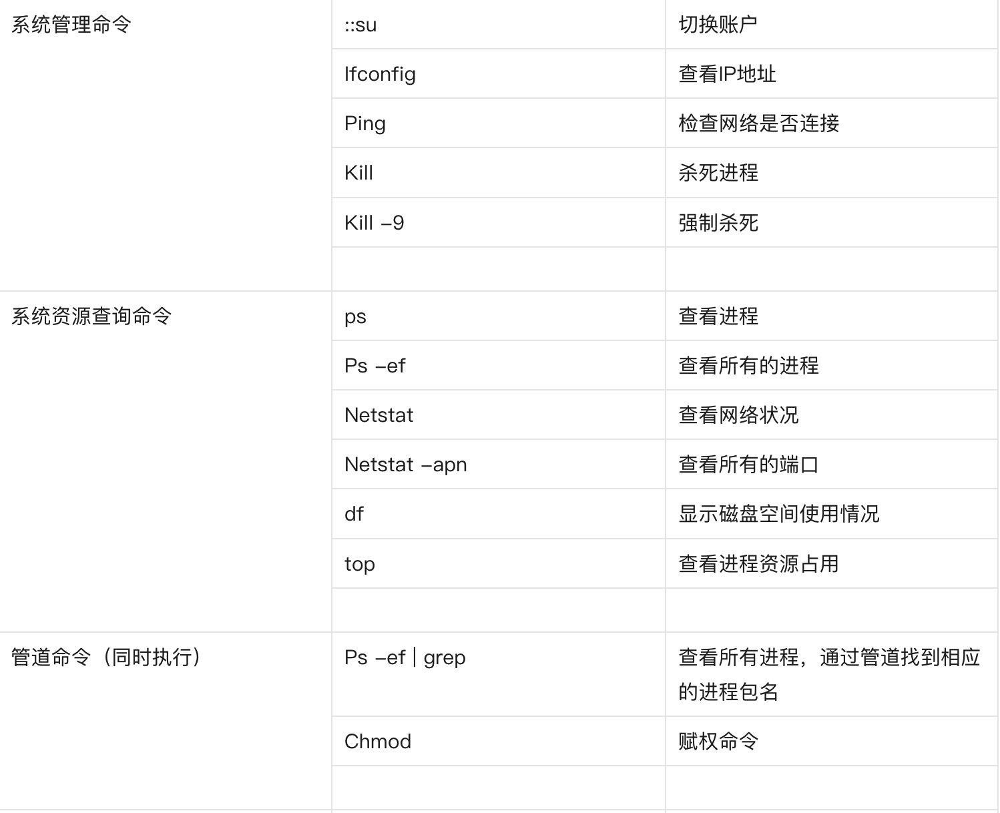
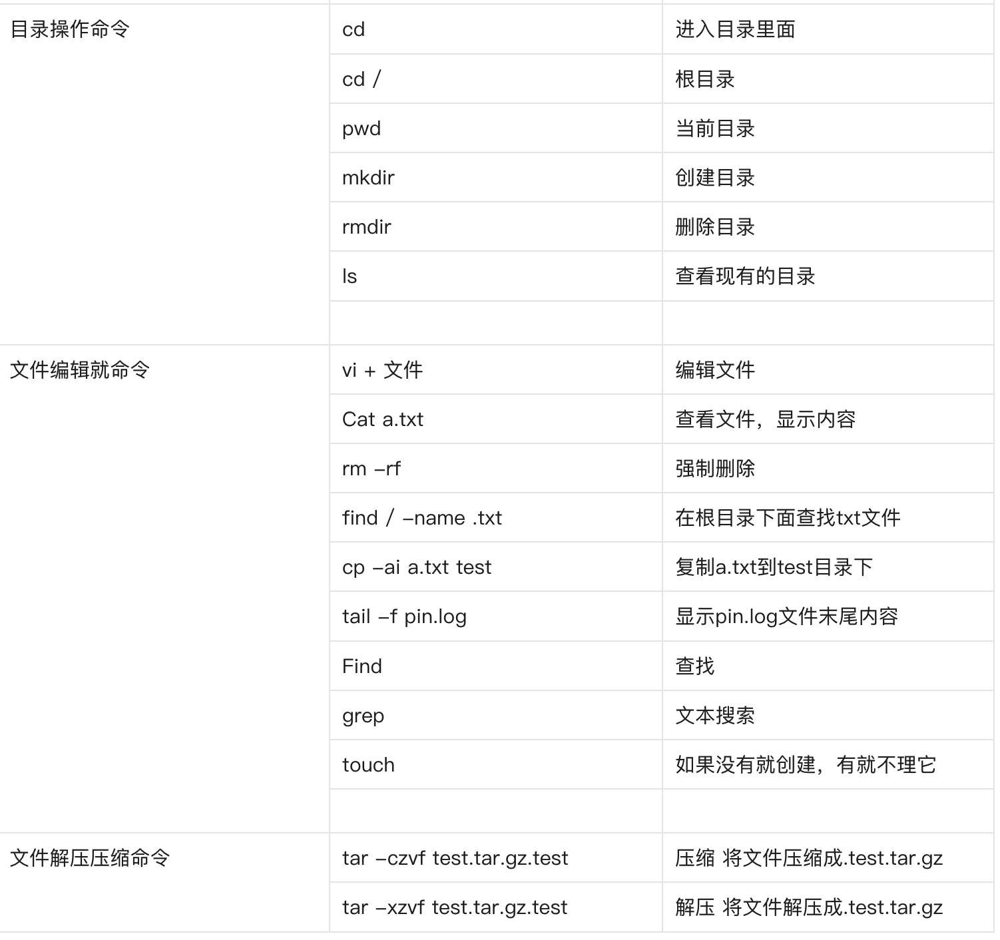
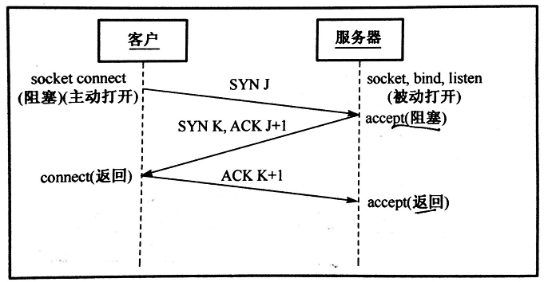

## 1、Linux操作过吗?说一说常见的命令和指令？
1.文件相关(mv mkdir cd ls)

2.docker相关(docker container ls docker ps -a )

3.权限相关(chmod chown useradd groupadd)

4.网络相关(netstat ip addr)

5.测试相关(测试连通性:ping 测试端口连通性:telnet)

 补充






## 2、select/poll/epoll的区别
select 和 poll 并没有本质区别，它们内部都是使用「线性结构」来存储进程关注的 Socket 集合。

在使用的时候，首先需要把关注的 Socket 集合通过 select/poll 系统调用从用户态拷贝到内核态，然后由内核检测事件，当有网络事件产生时，内核需要遍历进程关注 Socket 集合，找到对应的 Socket，并设置其状态为可读/可写，然后把整个 Socket 集合从内核态拷贝到用户态，用户态还要继续遍历整个 Socket 集合找到可读/可写的 Socket，然后对其处理。

很明显发现，select 和 poll 的缺陷在于，当客户端越多，也就是 Socket 集合越大，Socket 集合的遍历和拷贝会带来很大的开销，因此也很难应对 C10K。

epoll 是解决 C10K 问题的利器，通过两个方面解决了 select/poll 的问题。

- epoll 在内核里使用「红黑树」来关注进程所有待检测的 Socket，红黑树是个高效的数据结构，增删改一般时间复杂度是 O(logn)，通过对这棵黑红树的管理，不需要像 select/poll 在每次操作时都传入整个 Socket 集合，减少了内核和用户空间大量的数据拷贝和内存分配。
- epoll 使用事件驱动的机制，内核里维护了一个「链表」来记录就绪事件，只将有事件发生的 Socket 集合传递给应用程序，不需要像 select/poll 那样轮询扫描整个集合（包含有和无事件的 Socket ），大大提高了检测的效率。

## 3、Linux有哪些IO机制？
阻塞IO（Blocking IO）：应用程序在进行IO操作时，会一直阻塞等待IO完成，期间无法进行其他操作。

非阻塞IO（Non-blocking IO）：应用程序在进行IO操作时，会立即返回，无论IO操作是否完成，应用程序都可以进行其他操作。需要通过轮询的方式来判断IO是否完成，因此效率较低。

IO多路复用（IO Multiplexing）：通过select、poll、epoll等系统调用，在一个进程中可以同时监控多个文件描述符，当有任何一个文件描述符就绪时，就可以进行IO操作。

信号驱动IO（Signal Driven IO）：应用程序在进行IO操作时，向内核注册一个信号处理函数，内核在IO完成时会向应用程序发送一个信号，应用程序收到信号后再进行数据处理。

异步IO（Asynchronous IO）：应用程序进行IO操作时，可以立即返回，内核负责将数据读取到指定的缓冲区中，并在完成后通知应用程序，应用程序可以继续进行其他操作。异步IO需要操作系统和硬件的支持，目前主要应用于高性能IO场景。

## 4、select、poll、epoll，各自的优缺点？


 select缺点

select() 检测数量有限制，最大值通常为 1024（bit），每一个比特位对应一个监听的文件描述符
fd_set被内核修改后，不可以重用，每次都需要重置
每次调用select，都需要把fd集合从用户态拷贝到内核态，这个开销在fd很多时会很大
每次调用select都需要在内核遍历传递进来的所有fd，这个开销在fd很多时也很大（((时间复杂度是O(n)))）

 poll缺点

select第三四条缺点没有解决

每次调用select，都需要把**fd集合从用户态拷贝到内核态，这个开销在fd很多时会很大
每次调用select都需要在内核遍历传递进来的所有fd，这个开销在fd很多时也很大（((时间复杂度是O(n)))）

 epoll优点

epoll底层数据结构很好

红黑树增删改综合效率高

就绪的描述符的链表。当有的连接就绪的时候，内核会把就绪的连接放到 rdllist 链表里。这样应用进程只需要判断链表就能找出就绪进程，而不用去遍历整棵树。

## 5、 建立TCP服务器的各个系统调用过程是怎样的？会调用哪些网络编程函数？




- 服务器：

  - 创建socket -> int socket(int domain, int type, int protocol);

    - domain：协议域，决定了socket的地址类型，IPv4为AF_INET。

    - type：指定socket类型，SOCK_STREAM为TCP连接。

    - protocol：指定协议。IPPROTO_TCP表示TCP协议，为0时自动选择type默认协议。

  - 绑定socket和端口号 -> int bind(int sockfd, const struct sockaddr *addr, socklen_t addrlen);

    - sockfd：socket返回的套接字描述符，类似于文件描述符fd。

    - addr：有个sockaddr类型数据的指针，指向的是被绑定结构变量。

    ```C++
        // IPv4的sockaddr地址结构
        struct sockaddr_in {
            sa_family_t sin_family;    // 协议类型，AF_INET
            in_port_t sin_port;    // 端口号
            struct in_addr sin_addr;    // IP地址
        };
        struct in_addr {
            uint32_t s_addr;
        }
    ```

    - addrlen：地址长度。

  - 监听端口号 -> int listen(int sockfd, int backlog);

    - sockfd：要监听的sock描述字。

    - backlog：socket可以排队的最大连接数。

  - 接收用户请求 -> int accept(int sockfd, struct sockaddr *addr, socklen_t *addrlen);

    - sockfd：服务器socket描述字。

    - addr：指向地址结构指针。

    - addrlen：协议地址长度。

    - 注：一旦accept某个客户机请求成功将返回一个全新的描述符用于标识具体客户的TCP连接。

  - 从socket中读取字符 -> ssize_t read(int fd, void *buf, size_t count);

    - fd：连接描述字。

    - buf：缓冲区buf。

    - count：缓冲区长度。

    - 注：大于0表示读取的字节数，返回0表示文件读取结束，小于0表示发生错误。

  - 关闭socket -> int close(int fd);

    - fd：accept返回的连接描述字，每个连接有一个，生命周期为连接周期。

    - 注：sockfd是监听描述字，一个服务器只有一个，用于监听是否有连接；fd是连接描述字，用于每个连接的操作。

- 客户机：

  - 创建socket -> int socket(int domain, int type, int protocol);

  - 连接指定计算机 -> int connect(int sockfd, struct sockaddr* addr, socklen_t addrlen);
    - sockfd客户端的sock描述字。

    - addr：服务器的地址。

    - addrlen：socket地址长度。

  - 向socket写入信息 -> ssize_t write(int fd, const void *buf, size_t count);
    - fd、buf、count：同read中意义。

    - 大于0表示写了部分或全部数据，小于0表示出错。

  - 关闭oscket -> int close(int fd);
    - fd：同服务器端fd。

## 6、使用过哪些Linux命令？


## 7、epoll 的 LT ET 介绍一下
epoll的LT和ET模式是两种不同的工作方式。


LT模式是默认的工作方式，相当于一个效率很高的poll模型；而ET是高效工作方式。
 区别

LT和ET本质的区别是：LT模式状态时，主线程正在epoll_wait等待事件时，请求到了，epoll_wait返回后没有去处理请求(recv),那么下次epoll_wait时此请求还是会返回(立刻返回了);


而ET模式状态下，这次没处理，下次epoll_wait时将不返回(所以我们应该每次一定要处理),可见很大程度降低了epoll的触发次数。

## 8、Proactor主线程完成读写，并发高了怎么优化？
Proactor是一种异步I/O模型，它将I/O操作和业务逻辑解耦，降低了编程难度，但相应地，需要更多的线程资源。


如果主线程完成读写后并发高了，可以考虑使用Proactor模型来实现高并发处理。

Reactor模式是一种事件驱动的并发编程模型，它解决了在高并发环境下处理大量客户端请求的问题。Reactor模式的核心思想是将事件的处理逻辑与事件分发机制解耦，使得程序能够以非阻塞方式处理多个I/O事件。

## 9、多路复用了解吗？讲一下什么是IO多路复用
IO多路复用是一种处理多个IO流的技术。


它允许单个进程同时监视多个文件描述符，当一个或多个文件描述符准备好读或写时，它就可以立即响应。这种技术可以提高系统的并发性和响应能力，减少系统资源的浪费。 

在Linux中，epoll、select、poll都是IO多路复用的实现方式，他们都可以监视多个描述符，一旦某个描述符就绪(一般是读就绪或者写就绪),能够通知程序进行相应的读写操作。

 select

select是最早的IO多路复用机制，它只能同时监视fd的数量不超过1024个，而且每次只能监视一部分fd的状态变化。
 poll

poll和select类似，但是它可以同时监视fd的数量更多，达到了65536个。
 epoll

epoll是Linux所特有，它可以支持更多的fd数量，达到了8192个。此外，epoll还提供了更多的功能，如边缘触发等。

## 10、Linux 如何查看进程用到的端口?有什么命令？
可以使用以下命令查看进程使用的端口：

```bash
netstat -tunlp | grep <进程ID>
```

其中，`-t` 表示 TCP 连接，`-u` 表示 UDP 连接，`-n` 表示不进行 DNS 解析，`-l` 表示只显示监听状态的端口，`-p` 表示显示进程 ID 和名称。 

## 11、Linux 如何查看当前cpu状态？
您可以使用以下命令查看当前 CPU 状态：

```bash
top
```

其中，`top` 命令可以实时显示系统中各个进程的资源占用状况，类似于 Windows 的任务管理器。 

## 12、在没有root权限的情况下，如何拿到root中的文件？

在没有root权限的情况下，通常无法直接访问root用户的文件。

 几种方式

root用户是Linux系统中的超级管理员，拥有最高权限。但是，你可以尝试以下方法来获取root用户的文件：


1、请求root权限：如果你有合理的理由需要访问root用户的文件，可以与系统管理员联系，并请求临时获取root权限。他们可能会为你提供所需的文件或帮助你完成特定任务。


2、使用sudo命令：如果你被授予sudo权限，可以使用sudo命令来执行特定的命令，以获得root用户的文件。例如，可以使用以下命令将root用户的文件复制到当前用户的目录中：

```cpp
sudo cp /path/to/root/file /home/your_username/
```


3、使用su命令：如果你知道root用户的密码，并且被允许使用su命令，可以切换到root用户并访问其文件。首先，使用以下命令切换到root用户：

```cpp
su -
```

然后，输入root用户的密码。一旦成功切换到root用户，你可以访问其文件。


请注意，应该谨慎使用root权限，并仅在必要时使用。滥用root权限可能导致系统故障或安全问题。
