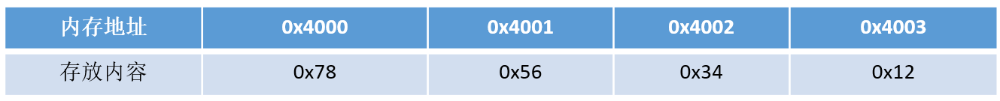
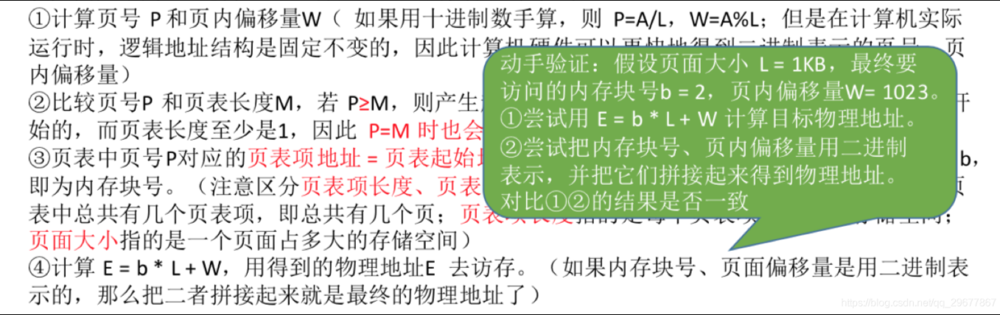

# 存储

## 01 堆和栈的区别


 申请方式不同

  - 栈由系统自动分配。

- 堆是自己申请和释放的。

  申请大小限制不同

  - 栈顶和栈底是之前预设好的，栈是向栈底扩展，大小固定，可以通过ulimit -a查看，由ulimit -s修改。

  - 堆向高地址扩展，是不连续的内存区域，大小可以灵活调整。

  申请效率不同

  - 栈由系统分配，速度快，不会有碎片。

  - 堆由程序员分配，速度慢，且会有碎片。

  

 栈空间默认是4M, 堆区一般是 1G - 4G 

|                  | 堆                                                           | 栈                                                           |
| :--------------- | ------------------------------------------------------------ | ------------------------------------------------------------ |
| **管理方式**     | 堆中资源由程序员控制（容易产生memory leak）                  | 栈资源由编译器自动管理，无需手工控制                         |
| **内存管理机制** | 系统有一个记录空闲内存地址的链表，当系统收到程序申请时，遍历该链表，寻找第一个空间大于申请空间的堆结点，删    除空闲结点链表中的该结点，并将该结点空间分配给程序（大多数系统会在这块内存空间首地址记录本次分配的大小，这样delete才能正确释放本内存空间，另外系统会将多余的部分重新放入空闲链表中） | 只要栈的剩余空间大于所申请空间，系统为程序提供内存，否则报异常提示栈溢出。（这一块理解一下链表和队列的区别，不连续空间和连续空间的区别，应该就比较好理解这两种机制的区别了） |
| **空间大小**     | 堆是不连续的内存区域（因为系统是用链表来存储空闲内存地址，自然不是连续的），堆大小受限于计算机系统中有效的虚拟内存（32bit  系统理论上是4G），所以堆的空间比较灵活，比较大 | 栈是一块连续的内存区域，大小是操作系统预定好的，windows下栈大小是2M（也有是1M，在  编译时确定，VC中可设置） |
| **碎片问题**     | 对于堆，频繁的new/delete会造成大量碎片，使程序效率降低       | 对于栈，它是有点类似于数据结构上的一个先进后出的栈，进出一一对应，不会产生碎片。（看到这里我突然明白了为什么面试官在问我堆和栈的区别之前先问了我栈和队列的区别） |
| **生长方向**     | 堆向上，向高地址方向增长。                                   | 栈向下，向低地址方向增长。                                   |
| **分配方式**     | 堆都是动态分配（没有静态分配的堆）                           | 栈有静态分配和动态分配，静态分配由编译器完成（如局部变量分配），动态分配由alloca函数分配，但栈的动态分配的资源由编译器进行释放，无需程序员实现。 |
| **分配效率**     | 堆由C/C++函数库提供，机制很复杂。所以堆的效率比栈低很多。    | 栈是其系统提供的数据结构，计算机在底层对栈提供支持，分配专门  寄存器存放栈地址，栈操作有专门指令。 |

  形象的比喻

栈就像我们去饭馆里吃饭，只管点菜（发出申请）、付钱、和吃（使用），吃饱了就走，不必理会切菜、洗菜等准备工作和洗碗、刷锅等扫尾工作，他的好处是快捷，但是自由度小。

堆就象是自己动手做喜欢吃的菜肴，比较麻烦，但是比较符合自己的口味，而且自由度大。


## 02 你觉得堆快一点还是栈快一点？/既然栈比堆的效率高，为什么不全用栈?

**毫无疑问是栈快一点**。

因为操作系统会在底层对栈提供支持，会分配专门的寄存器存放栈的地址，栈的入栈出栈操作也十分简单，并且有专门的指令执行，所以栈的效率比较高也比较快。

而堆的操作是由C/C++函数库提供的，在分配堆内存的时候需要一定的算法寻找合适大小的内存。并且获取堆的内容需要两次访问，第一次访问指针，第二次根据指针保存的地址访问内存，因此堆比较慢。

 原因

虽然栈比堆的效率高，但是栈的使用有一些限制：


- 大小限制：栈的大小是有限制的，通常是在编译时就确定的。当需要存储的数据超过栈的大小时，就会出现栈溢出的错误。


- 生命周期限制：栈上的数据的生命周期是在其所属的函数执行期间。一旦函数执行结束，栈上的数据会自动销毁。而堆上的数据可以在任何时候创建和销毁，生命周期更加灵活。


- 对象大小不确定：栈上的对象大小必须在编译时确定，而堆上的对象大小可以在运行时动态确定。


- 内存分配效率：栈上的内存分配是通过移动栈指针来实现的，非常高效。而堆上的内存分配需要使用动态分配算法，效率相对较低。

所以，栈和堆各有其适用的场景。对于需要在函数内部临时存储的小型数据，可以使用栈来提高效率。而对于需要动态分配、大小不确定或需要跨函数使用的大型数据，堆更加合适。

## 03 大小端存储是什么意思？如何区分？

  概念

大端存储：字数据的高字节存储在低地址中

小端存储：字数据的低字节存储在低地址中

例如：32bit的数字0x12345678


**所以在Socket编程中，往往需要将操作系统所用的小端存储的IP地址转换为大端存储，这样才能进行网络传输**

小端模式中的存储方式为：



大端模式中的存储方式为：


了解了大小端存储的方式，如何在代码中进行判断呢？下面介绍两种判断方式：

  **方式一：使用强制类型转换**-这种法子不错

```cpp
include <iostream>
using namespace std;
int main()
{
    int a = 0x1234;
    //由于int和char的长度不同，借助int型转换成char型，只会留下低地址的部分
    char c = (char)(a);
    if (c == 0x12)
        cout << "big endian" << endl;
    else if(c == 0x34)
        cout << "little endian" << endl;
}
```

  **方式二：巧用union联合体**

```cpp
include <iostream>
using namespace std;
//union联合体的重叠式存储，endian联合体占用内存的空间为每个成员字节长度的最大值
union endian
{
    int a;
    char ch;
};
int main()
{
    endian value;
    value.a = 0x1234;
    //a和ch共用4字节的内存空间
    if (value.ch == 0x12)
        cout << "big endian"<<endl;
    else if (value.ch == 0x34)
        cout << "little endian"<<endl;
}
```


## 04 如果系统中具有快表后，那么地址的转换过程变成什么样了？


 ①CPU给出逻辑地址，由某个硬件算得页号、页内偏移量，将页号与快表中的所有页号进行比较。

 ②如果找到匹配的页号，说明要访问的页表项在快表中有副本，则直接从中取出该页对应的内存块号，再将内存块号与页内偏移量拼接形成物理地址，最后，访问该物理地址对应的内存单元。因此，若快表命中，则访问某个逻辑地址仅需一次访存即可。

 ③如果没有找到匹配的页号，则需要访问内存中的页表，找到对应页表项，得到页面存放的内存块号，再将内存块号与页内偏移量拼接形成物理地址，最后，访问该物理地址对应的内存单元。因此,若快表未命中，则访问某个逻辑地址需要两次访存(注意:在找到页表项后，应同时将其存入快表,以便后面可能的再次访问。但若快表已满，则必须按照-定的算法对旧的页表项进行替换)


由于查询快表的速度比查询页表的速度快很多，因此只要快表命中，就可以节省很多时间。
因为局部性原理，–般来说快表的命中率可以达到90%以上。

 举个例子

例:某系统使用基本分页存储管理，并采用了具有快表的地址变换机构。访问- -次快表耗时1us， 访问一次内存耗时100us。若快表的命中率为90%，那么访问一个逻辑地址的平均耗时是多少?
(1+100) * 0.9 + (1+100+100) * 0.1 = 111 us
有的系统支持快表和慢表同时查找，如果是这样，平均耗时应该是(1+100) * 0.9+ (100+100) *0.1=110.9 us
若未采用快表机制，则访问一个逻辑地址需要100+100 = 200us
显然，引入快表机制后，访问一个逻辑地址的速度快多了。

## 05 内存交换和覆盖有什么区别？


交换技术主要是在不同进程（或作业）之间进行，而覆盖则用于同一程序或进程中。

## 06 动态分区分配算法有哪几种？可以分别说说吗？


 1、首次适应算法

算法思想：每次都从低地址开始查找，找到第–个能满足大小的空闲分区。

如何实现：空闲分区以地址递增的次序排列。每次分配内存时顺序查找空闲分区链( 或空闲分[表)，找到大小能满足要求的第-一个空闲分区。


 2、最佳适应算法

算法思想:由于动态分区分配是一种连续分配方式，为各进程分配的空间必须是连续的一整片区域。因此为了保证当“大进程”到来时能有连续的大片空间，可以尽可能多地留下大片的空闲区,即，优先使用更小的空闲区。

如何实现:空闲分区按容量递增次序链接。每次分配内存时顺序查找空闲分区链(或空闲分区表)，找到大小能满足要求的第-一个空闲分区。


 3、最坏适应算法

又称最大适应算法(Largest Fit)

算法思想:为了解决最佳适应算法的问题—即留下太多难以利用的小碎片，可以在每次分配时优先使用最大的连续空闲区，这样分配后剩余的空闲区就不会太小，更方便使用。

如何实现:空闲分区按容量递减次序链接。每次分配内存时顺序查找空闲分区链(或空闲分区表)，找到大小能满足要求的第-一个空闲分区。


 4、邻近适应算法

算法思想：首次适应算法每次都从链头开始查找的。这可能会导致低地址部分出现很多小的空闲分区，而每次分配查找时，都要经过这些分区，因此也增加了查找的开销。如果每次都从上次查找结束的位置开始检索，就能解决上述问题。

如何实现：空闲分区以地址递增的顺序排列(可排成-一个循环链表)。每次分配内存时从上次查找结束的位置开始查找空闲分区链(或空闲分区表)，找到大小能满足要求的第一个空闲分区。


 5、总结

首次适应不仅最简单，通常也是最好最快，不过首次适应算法会使得内存低地址部分出现很多小的空闲分区，而每次查找都要经过这些分区，因此也增加了查找的开销。邻近算法试图解决这个问题，但实际上，它常常会导致在内存的末尾分配空间分裂成小的碎片，它通常比首次适应算法结果要差。

最佳导致大量碎片，最坏导致没有大的空间。

进过实验，首次适应比最佳适应要好，他们都比最坏好。

| 算法     | 算法思想                                           | 分区排列顺序                                 | 优点                                                         | 缺点                                                         |
| -------- | -------------------------------------------------- | -------------------------------------------- | ------------------------------------------------------------ | ------------------------------------------------------------ |
| 首次适应 | 从头到尾找适合的分区                               | 空闲分区以地址递增次序排列                   | 综合看性能最好。**算法开销小**，回收分区后一.般不需要对空闲分区队列重新排序 |                                                              |
| 最佳适应 | 优先使用更小的分区，以保留更多大分区               | 空闲分区以容量递增次序排列                   | 会有更多的大分区被保留下来，更能满足大进程需求               | 会产生很多太小的、难以利用的碎片;**算法开销大**，回收分区后可能需要对空闲分区队列重新排序 |
| 最坏适应 | 优先使用更大的分区，以防止产生太小的不可用的碎片   | 空闲分区以容量递减次序排列                   | 可以减少难以利用的小碎片                                     | 大分区容易被用完，不利于大进程;**算法开销大**(原因同上)      |
| 邻近适应 | 由首次适应演变而来，每次从上次查找结束位置开始查找 | 空闲分区以地址递增次序排列(可排列成循环链表) | 不用每次都从低地址的小分区开始检索。**算法开销小**(原因同首次适应算法) | 会使高地址的大分区也被用完                                   |


## 07 介绍一下虚拟技术？


虚拟技术把一个物理实体转换为多个逻辑实体。

主要有两种虚拟技术：时（时间）分复用技术和空（空间）分复用技术。

多进程与多线程：多个进程能在同一个处理器上并发执行使用了时分复用技术，让每个进程轮流占用处理器，每次只执行一小个时间片并快速切换。

虚拟内存使用了空分复用技术，它将物理内存抽象为地址空间，每个进程都有各自的地址空间。地址空间的页被映射到物理内存，地址空间的页并不需要全部在物理内存中，当使用到一个没有在物理内存的页时，执行页面置换算法，将该页置换到内存中。

## 08 通过例子讲解逻辑地址转换为物理地址的基本过程


可以借助进程的页表将逻辑地址转换为物理地址。

通常会在系统中设置一个页表寄存器(PTR)，存放页表在内存中的起始地址F和页表长度M。进程未执行时，页表的始址和页表长度放在进程控制块(PCB) 中，当进程被调度时，操作系统内核会把它们放到页表寄存器中。

注意:页面大小是2的整数幂
设页面大小为L，逻辑地址A到物理地址E的变换过程如下:



例:若页面大小L为1K字节，页号2对应的内存块号b=8，将逻辑地址A=2500转换为物理地址E。
等价描述：某系统按字节寻址，逻辑地址结构中，页内偏移量占10位(说明一个页面的大小为2^10B = 1KB)，页号2对应的内存块号 b=8，将逻辑地址A=2500转换为物理地址E。

> ①计算页号、页内偏移量
> 页号P=A/L = 2500/1024 = 2; 页内偏移量W= A%L = 2500%1024 = 452
>
> ②根据题中条件可知，页号2没有越界，其存放的内存块号b=8
>
> ③物理地址E=b*L+W=8 * 1024+ 425 = 8644
>
> 在分页存储管理(页式管理)的系统中，只要确定了每个页面的大小，逻辑地址结构就确定了。因此，页式管理中地址是-维的。即，只要给出一个逻辑地址，系统就可以自动地算出页号、页内偏移量两个部分，并不需要显式地告诉系统这个逻辑地址中，页内偏移量占多少位。

## 09 操作系统在对内存进行管理的时候需要做些什么?

- 操作系统负责内存空间的分配与回收。
- 操作系统需要提供某种技术从逻辑上对内存空间进行扩充。
- 操作系统需要提供地址转换功能，负责程序的逻辑地址与物理地址的转换。
- 操作系统需要提供内存保护功能。保证各进程在各自存储空间内运行，互不干扰

## 10 虚拟内存的目的是什么？


虚拟内存的目的是为了让物理内存扩充成更大的逻辑内存，从而让程序获得更多的可用内存。

为了更好的管理内存，操作系统将内存抽象成地址空间。每个程序拥有自己的地址空间，这个地址空间被分割成多个块，每一块称为一页。

这些页被映射到物理内存，但不需要映射到连续的物理内存，也不需要所有页都必须在物理内存中。当程序引用到不在物理内存中的页时，由硬件执行必要的映射，将缺失的部分装入物理内存并重新执行失败的指令。

从上面的描述中可以看出，虚拟内存允许程序不用将地址空间中的每一页都映射到物理内存，也就是说一个程序不需要全部调入内存就可以运行，这使得有限的内存运行大程序成为可能。

例如有一台计算机可以产生 16 位地址，那么一个程序的地址空间范围是 0\~64K。该计算机只有 32KB 的物理内存，虚拟内存技术允许该计算机运行一个 64K 大小的程序。


## 11 说一下你理解中的内存？他有什么作用呢？


## 12 内存的覆盖是什么？有什么特点？


由于程序运行时并非任何时候都要访问程序及数据的各个部分（尤其是大程序），因此可以把用户空间分成为一个固定区和若干个覆盖区。将经常活跃的部分放在固定区，其余部分按照调用关系分段，首先将那些即将要访问的段放入覆盖区，其他段放在外存中，在需要调用前，系统将其调入覆盖区，替换覆盖区中原有的段。

覆盖技术的特点：是打破了必须将一个进程的全部信息装入内存后才能运行的限制，但当同时运行程序的代码量大于主存时仍不能运行，再而，大家要注意到，内存中能够更新的地方只有覆盖区的段，不在覆盖区的段会常驻内存。

## 13  内存交换是什么？有什么特点？


**交换(对换)技术的设计思想**：内存空间紧张时，系统将内存中某些进程暂时换出外存，把外存中某些已具备运行条件的进程换入内存(进程在内存与磁盘间动态调度)

换入：把准备好竞争CPU运行的程序从辅存移到内存。
换出：把处于等待状态（或CPU调度原则下被剥夺运行权力）的程序从内存移到辅存，把内存空间腾出来。


## 14 什么时候会进行内存的交换？


内存交换通常在许多进程运行且内存吃紧时进行，而系统负荷降低就暂停。例如:在发现许多进程运行时经常发生缺页，就说明内存紧张，此时可以换出一些进程;如果缺页率明显下降，就可以暂停换出。

## 15 什么是快表，你知道多少关于快表的知识？


快表，又称联想寄存器(TLB) ，是一种访问速度比内存快很多的高速缓冲存储器，用来存放当前访问的若干页表项，以加速地址变换的过程。与此对应，内存中的页表常称为慢表。


## 16 地址变换中，有快表和没快表，有什么区别？


|                        | 地址变换过程                                                 | 访问一个逻辑地址的访存次数                      |
| ---------------------- | ------------------------------------------------------------ | ----------------------------------------------- |
| 基本地址变换机构       | ①算页号、页内偏移量 ②检查页号合法性 ③查页表，找到页面存放的内存块号 ④根据内存块号与页内偏移量得到物理地址 ⑤访问目标内存单元 | 两次访存                                        |
| 具有快表的地址变换机构 | ①算页号、页内偏移量 ②检查页号合法性 ③查快表。若命中，即可知道页面存放的内存块号，可直接进行⑤;若未命中则进行④ ④查页表，找到页面存放的内存块号，并且将页表项复制到快表中 ⑤根据内存块号与页内偏移量得到物理地址 ⑥访问目标内存单元 | 快表命中，只需一次访存 快表未命中，需要两次访存 |


## 17 在执行malloc申请内存的时候，操作系统是怎么做的？


从操作系统层面上看，malloc是通过两个系统调用来实现的： brk和mmap

* brk是将进程数据段(.data)的最高地址指针向高处移动，这一步可以扩大进程在运行时的堆大小
* mmap是在进程的虚拟地址空间中寻找一块空闲的虚拟内存，这一步可以获得一块可以操作的堆内存。

通常，分配的内存小于128k时，使用brk调用来获得虚拟内存，大于128k时就使用mmap来获得虚拟内存。

进程先通过这两个系统调用获取或者扩大进程的虚拟内存，获得相应的虚拟地址，在访问这些虚拟地址的时候，通过缺页中断，让内核分配相应的物理内存，这样内存分配才算完成。

## 18 说说你了解的页面置换算法？（最全总结）


 1、最佳置换法(OPT)

最佳置换算法(OPT，Optimal) :每次选择淘汰的页面将是以后永不使用，或者在最长时间内不再被访问的页面，这样可以保证最低的缺页率。

最佳置换算法可以保证最低的缺页率，但实际上，只有在进程执行的过程中才能知道接下来会访问到的是哪个页面。操作系统无法提前预判页面访问序列。因此，最佳置换算法是无法实现的


 2、先进先出置换算法(FIFO)

先进先出置换算法(FIFO) :每次选择淘汰的页面是最早进入内存的页面
实现方法:把调入内存的页面根据调入的先后顺序排成一个队列，需要换出页面时选择队头页面队列的最大长度取决于系统为进程分配了多少个内存块。


Belady异常—当为进程分配的物理块数增大时，缺页次数不减反增的异常现象。

只有FIFO算法会产生Belady异常，而LRU和OPT算法永远不会出现Belady异常。另外，FIFO算法虽然实现简单，但是该算法与进程实际运行时的规律不适应，因为先进入的页面也有可能最经常被访问。因此，算法性能差

FIFO的性能较差，因为较早调入的页往往是经常被访问的页，这些页在FIFO算法下被反复调入和调出，并且有Belady现象。所谓Belady现象是指：采用FIFO算法时，如果对—个进程未分配它所要求的全部页面，有时就会出现分配的页面数增多但缺页率反而提高的异常现象。


 3、最近最久未使用置换算法(LRU)

最近最久未使用置换算法(LRU，least recently used) :每次淘汰的页面是最近最久未使用的页面
实现方法:赋予每个页面对应的页表项中，用访问字段记录该页面自.上次被访问以来所经历的时间t(该算法的实现需要专门的硬件支持，虽然算法性能好，但是实现困难，开销大)。当需要淘汰一个页面时，选择现有页面中t值最大的，即最近最久未使用的页面。

LRU性能较好，但需要寄存器和栈的硬件支持。LRU是堆栈类算法，理论上可以证明，堆栈类算法不可能出现Belady异常。


在手动做题时，若需要淘汰页面，可以逆向检查此时在内存中的几个页面号。在逆向扫描过程中最后一个出现的页号就是要淘汰的页面。


 4、时钟置换算法(CLOCK)

最佳置换算法性OPT能最好，但无法实现；先进先出置换算法实现简单，但算法性能差；最近最久未使用置换算法性能好，是最接近OPT算法性能的，但是实现起来需要专门的硬件支持，算法开销大。

所以操作系统的设计者尝试了很多算法，试图用比较小的开销接近LRU的性能，这类算法都是CLOCK算法的变体，因为算法要循环扫描缓冲区像时钟一样转动。所以叫clock算法。

时钟置换算法是一种性能和开销较均衡的算法，又称CLOCK算法，或最近未用算法(NRU，Not Recently Used)

简单的CLOCK算法实现方法:为每个页面设置一个访问位，再将内存中的页面都通过链接指针链接成一个循环队列。当某页被访问时，其访问位置为1。当需要淘汰-一个页面时，只需检查页的访问位。如果是0，就选择该页换出;如果是1，则将它置为0，暂不换出，继续检查下一个页面，若第- - ~轮扫描中所有页面都是1，则将这些页面的访问位依次置为0后，再进行第二轮扫描(第二轮扫描中一定会有访问位为0的页面，因此简单的CLOCK算法选择–个淘汰页面最多会经过两轮扫描)


 5、改进型的时钟置换算法

简单的时钟置换算法仅考虑到一个页面最近是否被访问过。事实上，如果被淘汰的页面没有被修改过,就不需要执行I/O操作写回外存。只有被淘汰的页面被修改过时，才需要写回外存。

因此，除了考虑一个页面最近有没有被访问过之外，操作系统还应考虑页面有没有被修改过。在其他条件都相同时，应优先淘汰没有修改过的页面，避免I/O操作。这就是改进型的时钟置换算法的思想。修改位=0，表示页面没有被修改过;修改位=1，表示页面被修改过。

为方便讨论，用(访问位，修改位)的形式表示各页面状态。如(1, 1)表示一个页面近期被访问过，且被修改过。

改进型的Clock算法需要综合考虑某一内存页面的访问位和修改位来判断是否置换该页面。在实际编写算法过程中，同样可以用一个等长的整型数组来标识每个内存块的修改状态。访问位A和修改位M可以组成一下四种类型的页面。

算法规则:将所有可能被置换的页面排成–个循环队列

> 第一轮:从当前位置开始扫描到第一个(A =0, M = 0)的帧用于替换。表示该页面最近既未被访问，又未被修改，是最佳淘汰页
> 第二轮:若第一轮扫描失败，则重新扫描，查找第一个(A =1, M = 0)的帧用于替换。本轮将所有扫描过的帧访问位设为0。表示该页面最近未被访问，但已被修改，并不是很好的淘汰页。
> 第三轮:若第二轮扫描失败，则重新扫描，查找第一个(A =0, M = 1)的帧用于替换。本轮扫描不修改任何标志位。表示该页面最近已被访问，但未被修改，该页有可能再被访问。
> 第四轮:若第三轮扫描失败，则重新扫描，查找第一个A =1, M = 1)的帧用于替换。表示该页最近已被访问且被修改，该页可能再被访问。

由于第二轮已将所有帧的访问位设为0，因此经过第三轮、第四轮扫描一定会有一个帧被选中，因此改进型CLOCK置换算法选择- -个淘汰页面最多会进行四轮扫描


算法规则：将所有可能被置换的页面排成一个循环队列
第一轮:从当前位置开始扫描到第-一个(0, 0)的帧用于替换。本轮扫描不修改任何标志位。(第一优先级:最近没访问，且没修改的页面)
第二轮:若第一轮扫描失败，则重新扫描，查找第一个(0, 1)的帧用于替换。本轮将所有扫描过的帧访问位设为0
(第二优先级: 最近没访问，但修改过的页面)
第三轮:若第二轮扫描失败，则重新扫描，查找第一个(0, 0)的帧用于替换。本轮扫描不修改任何标志位(第三优先级:最近访问过，但没修改的页面)
第四轮:若第三轮扫描失败，则重新扫描，查找第一个(0, 1)的帧用于替换。(第四优先级:最近访问过，且修改过的页面)
由于第二轮已将所有帧的访问位设为0，因此经过第三轮、第四轮扫描一定会有一个帧被选中，因此改进型CLOCK置换算法选择一个淘汰页面最多会进行四轮扫描

 6、总结

|                         | 算法规则                                                     | 优缺点                                          |
| ----------------------- | ------------------------------------------------------------ | ----------------------------------------------- |
| OPT                     | 优先淘汰最长时间内不会被访问的页面                           | 缺页率最小，性能最好;但无法实现                 |
| FIFO                    | 优先淘汰最先进入内存的页面                                   | 实现简单;但性能很差，可能出现Belady异常         |
| LRU                     | 优先淘汰最近最久没访问的页面                                 | 性能很好;但需要硬件支持，算法开销大             |
| CLOCK (NRU)             | 循环扫描各页面 第一轮淘汰访问位=0的，并将扫描过的页面访问位改为1。若第-轮没选中，则进行第二轮扫描。 | 实现简单，算法开销小;但未考虑页面是否被修改过。 |
| 改进型CLOCK (改进型NRU) | 若用(访问位，修改位)的形式表述，则 第一轮:淘汰(0,0) 第二轮:淘汰(O,1)，并将扫描过的页面访问位都置为0 第三轮:淘汰(O, 0) 第四轮:淘汰(0, 1) | 算法开销较小，性能也不错                        |


## 19 内存交换了解吗？可以说说你理解中的内存交换？


1. 交换需要备份存储，通常是快速磁盘，它必须足够大，并且提供对这些内存映像的直接访问。
2. 为了有效使用CPU，需要每个进程的执行时间比交换时间长，而影响交换时间的主要是转移时间，转移时间与所交换的空间内存成正比。
3. 如果换出进程，比如确保该进程的内存空间成正比。
4. 交换空间通常作为磁盘的一整块，且独立于文件系统，因此使用就可能很快。
5. 交换通常在有许多进程运行且内存空间吃紧时开始启动，而系统负荷降低就暂停。
6. 普通交换使用不多，但交换的策略的某些变种在许多系统中（如UNIX系统）仍然发挥作用。


## 20 内存交换中，被换出的进程保存在哪里？


保存在磁盘中，也就是外存中。具有对换功能的操作系统中，通常把磁盘空间分为文件区和对换区两部分。文件区主要用于存放文件，主要追求存储空间的利用率，因此对文件区空间的管理采用离散分配方式;对换区空间只占磁盘空间的小部分，被换出的进程数据就存放在对换区。

由于对换的速度直接影响到系统的整体速度，因此对换区空间的管理主要追求换入换出速度，因此通常对换区采用连续分配方式(学过文件管理章节后即可理解)。总之，对换区的I/O速度比文件区的更快。

## 21 常见内存分配方式有哪些？

**内存分配方式**

 （1） 从静态存储区域分配。

内存在程序编译的时候就已经分配好，这块内存在程序的整个运行期间都存在。例如全局变量，static变量。

 （2） 在栈上创建。

在执行函数时，函数内局部变量的存储单元都可以在栈上创建，函数执行结束时这些存储单元自动被释放。栈内存分配运算内置于处理器的指令集中，效率很高，但是分配的内存容量有限。

 （3） 从堆上分配，亦称动态内存分配。

程序在运行的时候用malloc或new申请任意多少的内存，程序员自己负责在何时用free或delete释放内存。动态内存的生存期由我们决定，使用非常灵活，但问题也最多。


## 22 抖动你知道是什么吗？它也叫颠簸现象


刚刚换出的页面马上又要换入内存，刚刚换入的页面马上又要换出外存，这种频繁的页面调度行为称为抖动，或颠簸。

产生抖动的主要原因是进程频繁访问的页面数目高于可用的物理块数(分配给进程的物理块不够)

为进程分配的物理块太少，会使进程发生抖动现象。

为进程分配的物理块太多，又会降低系统整体的并发度，降低某些资源的利用率


## 23 交换空间与虚拟内存的关系


 **交换空间**

Linux 中的交换空间（Swap space）在**物理内存**（RAM）被充满时被使用。如果系统需要更多的内存资源，而物理内存已经充满，内存中不活跃的页就会被移到交换空间去。

虽然交换空间可以为带有少量内存的机器提供帮助，但是这种方法不应该被当做是对内存的取代。交换空间位于硬盘驱动器上，它比进入物理内存要慢。

交换空间可以是一个专用的交换分区（推荐的方法），交换文件，或两者的组合。 

交换空间的总大小应该相当于你的计算机内存的两倍和 32 MB这两个值中较大的一个，但是它不能超过 2048MB（2 GB）。 

 **虚拟内存**

虚拟内存是文件数据交叉链接的活动文件。是WINDOWS目录下的一个"WIN386.SWP"文件，这个文件会不断地扩大和自动缩小。 
就速度方面而言,CPU的L1和L2缓存速度最快，内存次之，硬盘再次之。但是**虚拟内存使用的是硬盘的空间**，为什么我们要使用速度最慢的硬盘来做 为虚拟内存呢？

因为电脑中所有运行的程序都需要经过内存来执行，如果执行的程序很大或很多，就会导致我们只有可怜的256M/512M内存消耗殆尽。

而硬盘空间动辄几十G上百G，为了解决这个问题，Windows中运用了虚拟内存技术，即拿出一部分硬盘空间来充当内存使用。 


## 24 常见的几种磁盘调度算法


读写一个磁盘块的时间的影响因素有：

- 旋转时间（主轴转动盘面，使得磁头移动到适当的扇区上）
- 寻道时间（制动手臂移动，使得磁头移动到适当的磁道上）
- 实际的数据传输时间

其中，寻道时间最长，因此磁盘调度的主要目标是使磁盘的平均寻道时间最短。

  1. 先来先服务

按照磁盘请求的顺序进行调度。

优点是公平和简单。缺点也很明显，因为未对寻道做任何优化，使平均寻道时间可能较长。

  2. 最短寻道时间优先

优先调度与当前磁头所在磁道距离最近的磁道。

虽然平均寻道时间比较低，但是不够公平。如果新到达的磁道请求总是比一个在等待的磁道请求近，那么在等待的磁道请求会一直等待下去，也就是出现饥饿现象。具体来说，两端的磁道请求更容易出现饥饿现象。


  3. 电梯扫描算法

电梯总是保持一个方向运行，直到该方向没有请求为止，然后改变运行方向。

电梯算法（扫描算法）和电梯的运行过程类似，总是按一个方向来进行磁盘调度，直到该方向上没有未完成的磁盘请求，然后改变方向。

因为考虑了移动方向，因此所有的磁盘请求都会被满足，解决了 SSTF 的饥饿问题。


## 25 Windows和Linux环境下内存分布情况


通过这张图你可以看到，用户空间内存，从**低到高**分别是 7 种不同的内存段：

- 程序文件段，包括二进制可执行代码；
- 已初始化数据段，包括静态常量；
- 未初始化数据段，包括未初始化的静态变量；
- 堆段，包括动态分配的内存，从低地址开始向上增长；
- 文件映射段，包括动态库、共享内存等，从低地址开始向上增长（跟硬件和内核版本有关）
- 栈段，包括局部变量和函数调用的上下文等。栈的大小是固定的，一般是 `8 MB`。当然系统也提供了参数，以便我们自定义大小；

## 26 一般情况下在Linux/windows平台下栈空间的大小有多少？


Linux环境下有操作系统决定，一般是8MB，8192KB，通过ulimit命令查看以及修改

Windows环境下由编译器决定，VC++6.0一般是1M

 **Linux**

linux下非编译器决定栈大小，而是由操作系统环境决定，默认是8192KB（8M）；而在Windows平台下栈的大小是被记录在可执行文件中的（由编译器来设置)，即：windows下可以由编译器决定栈大小，而在Linux下是由系统环境变量来控制栈的大小的。

 在Linux下通过如下命令可查看和设置栈的大小：

```shell
$ ulimit -a             显示当前栈的大小 （ulimit为系统命令，非编译器命令）       
$ ulimit -s 32768       设置当前栈的大小为32M
```

 **Windows**

下程序栈空间的大小，VC++ 6.0 默认的栈空间是1M。


VC6.0中修改堆栈大小的方法：

- 选择 "Project->Setting"
- 选择 "Link"
- 选择 "Category"中的 "Output"
- 在 "Stack allocations"中的"Reserve:"中输栈的大小

## 27 内部碎片与外部碎片


  内碎片

分配给某些进程的内存区域中有些部分没用上，常见于固定分配方式

内存总量相同，100M

固定分配，将100M分割成10块，每块10M，一个程序需要45M，那么需要分配5块，第五块只用了5M，剩下的5M就是内部碎片；

分段式分配，按需分配，一个程序需要45M，就给分片45MB，剩下的55M供其它程序使用，不存在内部碎片。


  外碎片

内存中某些空闲区因为比较小，而难以利用上，一般出现在内存动态分配方式中

分段式分配：内存总量相同，100M，比如，内存分配依次5M，15M，50M，25M，程序运行一段时间之后，5M，15M的程序运行完毕，释放内存，其他程序还在运行，再次分配一个10M的内存供其它程序使用，只能从头开始分片，这样，就会存在10M+5M的外部碎片 。

## 28 分段和分页的区别

分页和分段都是操作系统中的存储管理技术，但它们有一些区别。

 分页
分页是将物理内存分成固定大小的块，称为页框，再将逻辑地址分成相同大小的页，然后将每个页映射到一个页框中。而
 分段
分段是将物理内存分成固定大小的块，称为段，再将逻辑地址分成相同大小的段，然后将每个段映射到一个段表中。 

 总结
采用分页是为了消除内存碎片，提高内存利用率，仅仅是系统的行为，对用户是不可见的。而分段的目的主要是为了更好地满足用户的需要。

## 29 虚拟地址是怎么转化到物理地址的？


虚拟地址到物理地址的转化是通过页表(Page Table)来实现的。页表是一种数据结构，用于将虚拟地址映射到物理地址。

在分段和分页机制下，CPU会将虚拟地址转换为线性地址，然后再将线性地址转换为物理地址。 

 拓展

分段机制简单的来说是将进程的代码、数据、栈分在不同的虚拟地址段上，从而避免了不同段之间的内存访问冲突。

分页机制则是为了解决分段机制中存在的问题而提出的。它将进程的代码、数据、栈等分成多个大小相等的页，每个页都有一个唯一的页号，这样就可以将整个进程映射到一个连续的物理地址空间上了。

## 30 内存

**逻辑地址VS物理地址**

- 相对地址又称逻辑地址。
- 绝对地址又称物理地址。 

编译时只需确定变量x存放的相对地址是100 ( 也就是说相对于进程在内存中的起始地址而言的地址)。CPU想要找到x在内存中的实际存放位置，只需要用进程的起始地址+100即可。 
